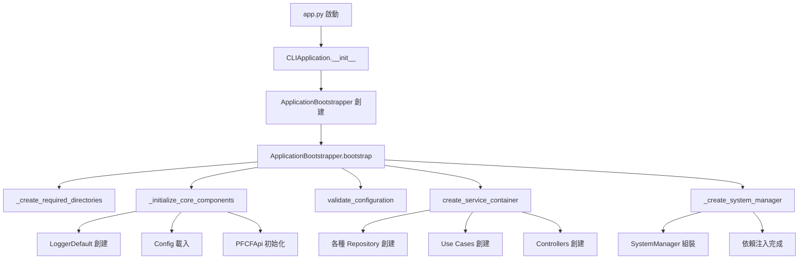
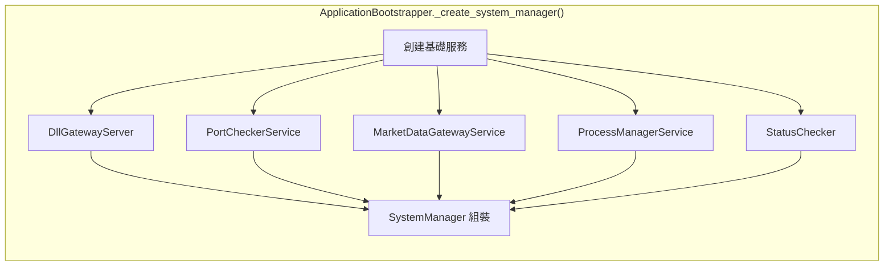
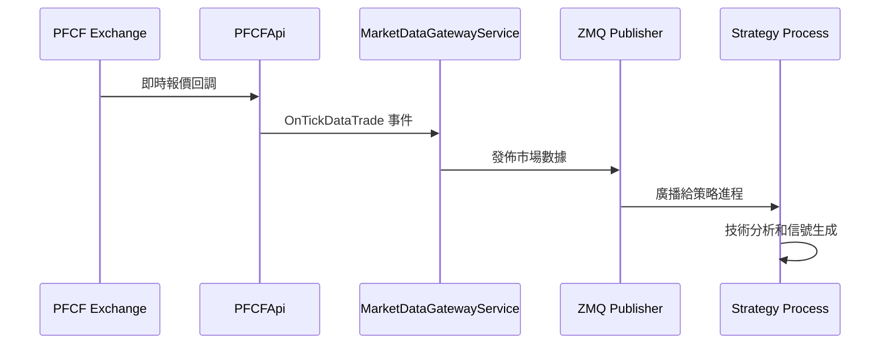
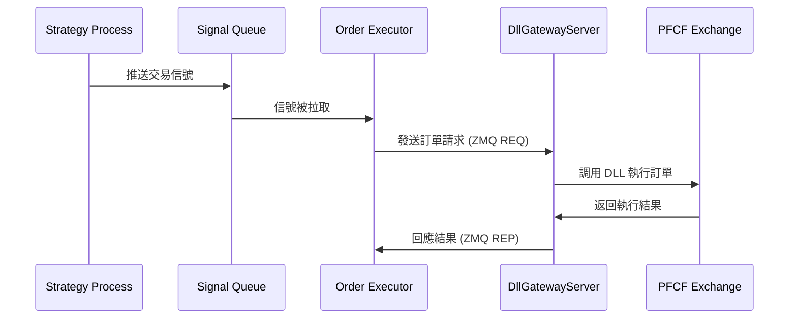
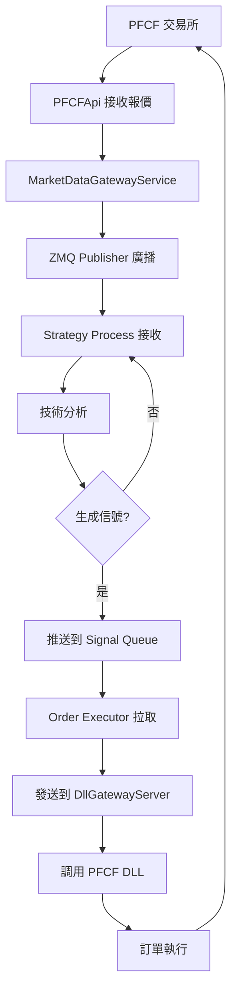
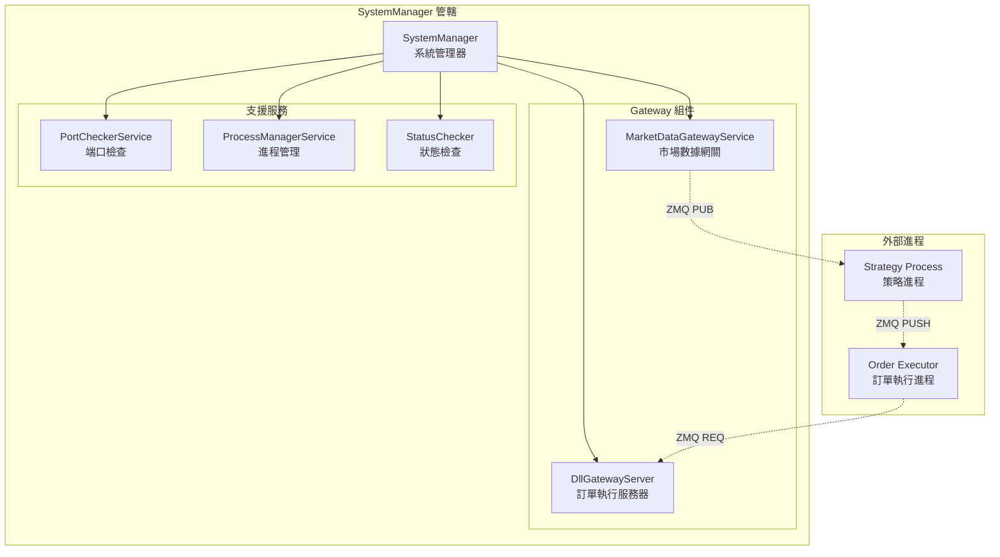
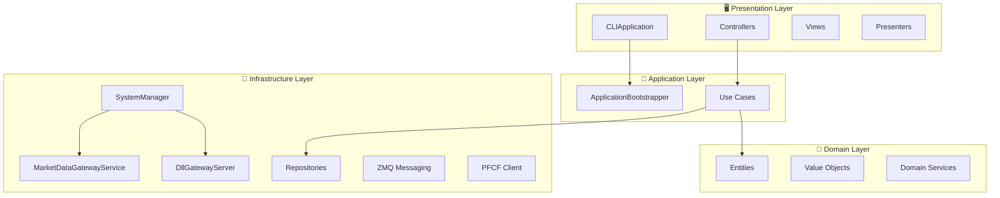

# 🏗️ Auto Futures Trading Machine - 架構詳解

## 📋 目錄
1. [系統總覽](#系統總覽)
2. [app.py 啟動流程](#apppy-啟動流程)
3. [類別職責分工](#類別職責分工)
4. [數據流向圖](#數據流向圖)
5. [組件交互圖](#組件交互圖)
6. [OOP 設計原則](#oop-設計原則)

---

## 系統總覽

這是一個多進程的期貨自動交易系統，採用 Clean Architecture 設計，主要分為三個進程：

```
┌─────────────────────────────────────────────────────────┐
│                    🖥️  Main Process                     │
│                      (app.py)                          │
│  ┌─────────────────┐  ┌─────────────────┐              │
│  │ CLIApplication  │  │ SystemManager   │              │
│  │                 │  │                 │              │
│  │ ├─ 用戶界面       │  │ ├─ 生命週期管理   │              │
│  │ ├─ 菜單系統       │  │ ├─ 組件協調      │              │
│  │ └─ 指令處理       │  │ └─ 狀態監控      │              │
│  └─────────────────┘  └─────────────────┘              │
│           │                      │                     │
│           │              ┌─────────────────┐            │
│           └──────────────│ MarketDataGateway │          │
│                          │ + DllGatewayServer │         │
│                          └─────────────────┘            │
└─────────────────────────────────────────────────────────┘
                              │
                              │ ZMQ 通信
                              │
         ┌────────────────────┼────────────────────┐
         │                   │                    │
         ▼                   ▼                    ▼
┌─────────────────┐ ┌─────────────────┐ ┌─────────────────┐
│  📊 Strategy    │ │  📈 Market Data │ │  💼 Order       │
│    Process      │ │    Flow         │ │   Executor      │
│                 │ │                 │ │   Process       │
│ ├─ 技術分析      │ │ ├─ 即時報價      │ │ ├─ 訂單執行      │
│ ├─ 信號生成      │ │ ├─ 價格廣播      │ │ ├─ 風險控制      │
│ └─ 策略邏輯      │ │ └─ 數據分發      │ │ └─ 執行確認      │
└─────────────────┘ └─────────────────┘ └─────────────────┘
```

---

## app.py 啟動流程

### 1️⃣ **應用程式初始化階段**



### 2️⃣ **系統管理器組裝過程**



---

## 類別職責分工

### 🎯 **主要類別與職責**

#### **應用程式層 (Application Layer)**

```
CLIApplication
├── 🎮 職責: 應用程式生命週期管理
├── 📝 功能: 
│   ├─ 啟動和關閉應用程式
│   ├─ 例外處理和優雅退出
│   └─ 用戶界面協調
└── 🔗 依賴: ApplicationBootstrapper, SystemManager
```

```
ApplicationBootstrapper  
├── 🏗️ 職責: 依賴注入和初始化
├── 📝 功能:
│   ├─ 創建所有服務實例
│   ├─ 配置驗證
│   ├─ 服務容器組裝
│   └─ SystemManager 建構
└── 🔗 依賴: Config, Logger, PFCFApi
```

#### **基礎設施層 (Infrastructure Layer)**

```
SystemManager
├── 🎛️ 職責: 系統組件生命週期管理
├── 📝 功能:
│   ├─ 啟動/停止交易系統
│   ├─ 組件狀態監控
│   ├─ 健康檢查
│   └─ 組件重啟
└── 🔗 管理:
    ├─ MarketDataGatewayService
    ├─ DllGatewayServer  
    ├─ ProcessManagerService
    └─ PortCheckerService
```

```
MarketDataGatewayService
├── 📊 職責: 市場數據基礎設施
├── 📝 功能:
│   ├─ ZMQ Publisher 初始化
│   ├─ PFCF API 回調連接
│   ├─ 即時報價廣播
│   └─ 數據流管理
└── 🔗 依賴: ZmqPublisher, TickProducer, PFCFApi
```

```
DllGatewayServer
├── 💼 職責: 訂單執行服務器
├── 📝 功能:
│   ├─ ZMQ REQ/REP 服務器
│   ├─ 訂單請求處理
│   ├─ PFCF DLL 調用
│   └─ 執行結果回應
└── 🔗 依賴: PFCFApi, ZMQ REP Socket
```

#### **業務邏輯層 (Interactor Layer)**

```
Use Cases (各種業務用例)
├── 🎯 職責: 業務邏輯封裝
├── 📝 功能:
│   ├─ 業務規則執行
│   ├─ 數據驗證
│   ├─ 錯誤處理
│   └─ 結果回傳
└── 🔗 依賴: Entities, Repositories, Services
```

---

## 數據流向圖

### 📈 **市場數據流向**



### 💰 **訂單執行流向**



### 🔄 **完整交易週期**



---

## 組件交互圖

### 🎛️ **SystemManager 的管理範圍**



### 🏛️ **Clean Architecture 層次**



---

## OOP 設計原則

### 🎯 **SOLID 原則應用**

#### **S - Single Responsibility Principle (單一職責)**
- ✅ `MarketDataGatewayService`: 只負責市場數據發佈
- ✅ `DllGatewayServer`: 只負責訂單執行
- ✅ `SystemManager`: 只負責組件生命週期管理

#### **O - Open/Closed Principle (開放封閉)**
- ✅ 使用 Interface 定義契約 (`MarketDataGatewayServiceInterface`)
- ✅ 可擴展新的交易策略而不修改現有代碼

#### **L - Liskov Substitution Principle (里氏替換)**
- ✅ 所有服務都實現對應的 Interface
- ✅ 可以輕鬆替換不同的實現

#### **I - Interface Segregation Principle (接口隔離)**
- ✅ 分離不同職責的接口
- ✅ 客戶端只依賴需要的接口

#### **D - Dependency Inversion Principle (依賴反轉)**
- ✅ 高層模組 (Use Cases) 不依賴低層模組 (Infrastructure)
- ✅ 都依賴於抽象 (Interfaces)

### 🔄 **設計模式應用**

#### **Repository Pattern (倉庫模式)**
```python
# 抽象
SessionRepositoryInterface
# 實現
SessionInMemoryRepository
SessionJsonFileRepository
```

#### **Dependency Injection (依賴注入)**
```python
# ApplicationBootstrapper 負責組裝所有依賴
system_manager = SystemManager(
    logger=logger,
    market_data_gateway=market_data_gateway,
    dll_gateway_server=dll_gateway_server,
    # ...其他依賴
)
```

#### **Observer Pattern (觀察者模式)**
```python
# PFCF API 回調機制
exchange_client.DQuoteLib.OnTickDataTrade += tick_producer.handle_tick_data
```

#### **Command Pattern (命令模式)**
```python
# Use Cases 封裝業務操作
class SendMarketOrderUseCase:
    def execute(self, input_dto: SendMarketOrderInputDto) -> SendMarketOrderOutputDto
```

---

## 🎯 **總結**

這個架構的核心優勢：

1. **🔧 模組化設計**: 每個類別都有明確的職責
2. **🔄 可測試性**: 依賴注入讓單元測試變得容易
3. **📈 可擴展性**: 遵循 SOLID 原則，易於擴展新功能
4. **🛡️ 可維護性**: Clean Architecture 讓代碼結構清晰
5. **⚡ 高性能**: 多進程設計繞過 Python GIL 限制

通過這個文檔，開發者可以：
- 快速理解系統整體架構
- 找到需要修改的具體類別
- 了解數據如何在系統中流動
- 掌握各組件的交互關係