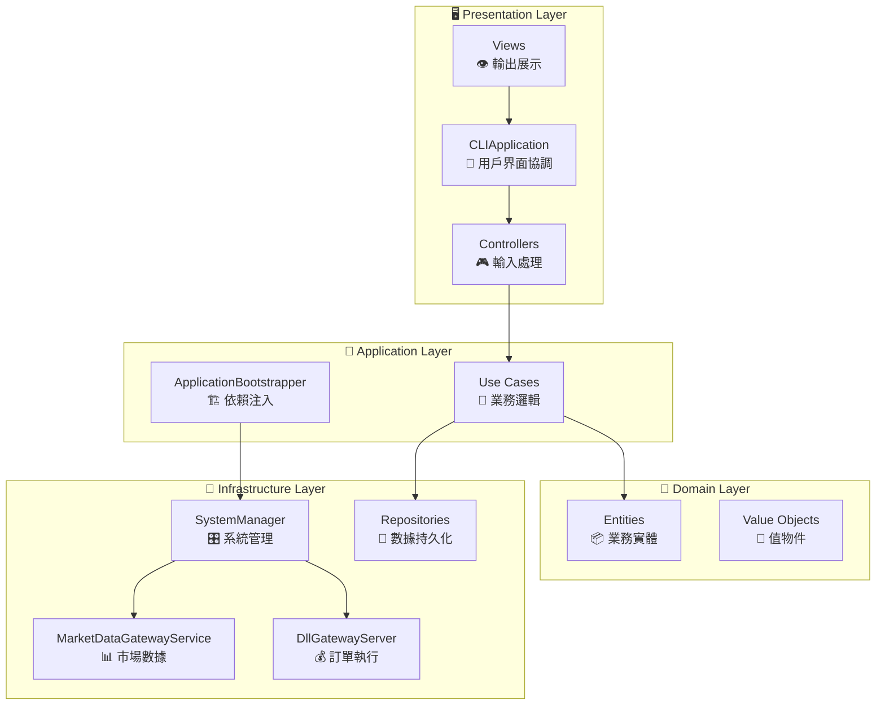
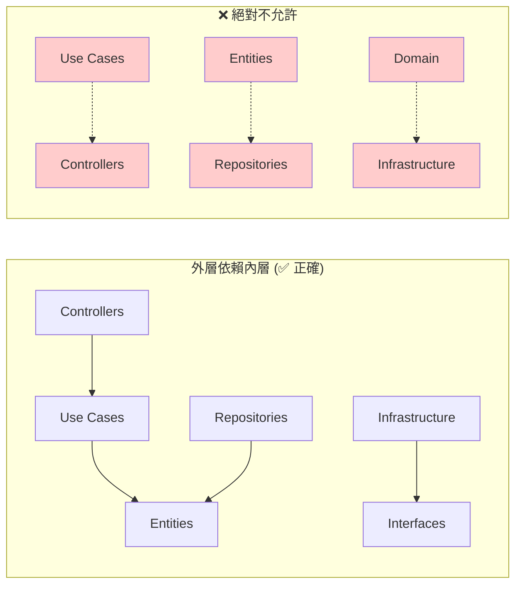
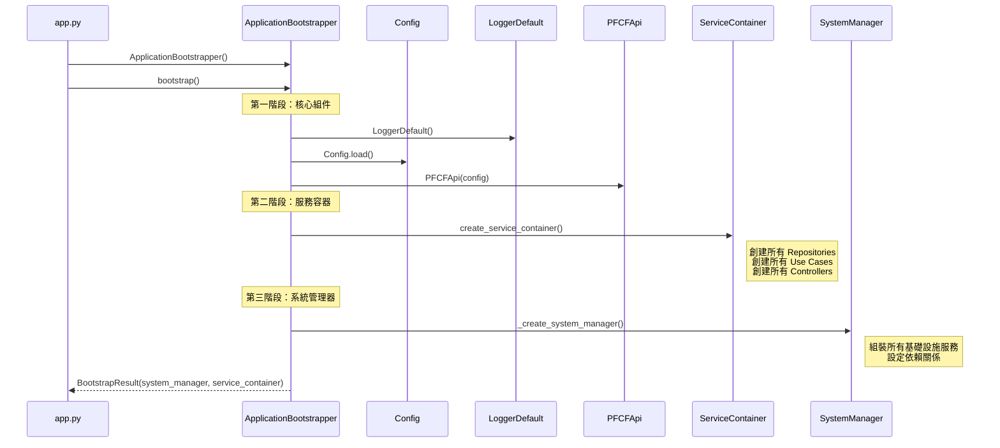

# 🏛️ Auto Futures Trading Machine - 類別設計指南

## 📋 目錄
1. [類別職責矩陣](#類別職責矩陣)
2. [Clean Architecture 層次分析](#clean-architecture-層次分析)
3. [依賴注入流程](#依賴注入流程)
4. [核心類別詳解](#核心類別詳解)
5. [設計模式應用](#設計模式應用)
6. [擴展指南](#擴展指南)

---

## 類別職責矩陣

### 🎯 **核心類別一覽表**

| 類別名稱 | 層次 | 主要職責 | 依賴關係 | 生命週期 |
|---------|------|---------|---------|---------|
| `CLIApplication` | Presentation | 用戶界面協調 | SystemManager, ServiceContainer | Singleton |
| `ApplicationBootstrapper` | Application | 依賴注入管理 | Config, Logger, PFCFApi | Transient |
| `SystemManager` | Infrastructure | 系統生命週期管理 | 6個基礎設施服務 | Singleton |
| `MarketDataGatewayService` | Infrastructure | 市場數據發佈 | ZMQ, TickProducer, PFCFApi | Singleton |
| `DllGatewayServer` | Infrastructure | 訂單執行服務 | ZMQ REP, PFCFApi | Singleton |
| `各種 Use Cases` | Interactor | 業務邏輯封裝 | Entities, Repositories | Per-Request |
| `各種 Controllers` | Presentation | 用戶輸入處理 | Use Cases, Presenters | Per-Request |

### 🔄 **職責流向圖**



---

## Clean Architecture 層次分析

### 🏛️ **依賴規則遵循情況**



### 📊 **層次職責分工**

#### **🖥️ Presentation Layer (表現層)**
```python
# 職責：處理用戶交互和數據展示
class CLIApplication:
    """
    🎯 職責：
    - 管理整個應用程式生命週期
    - 協調各個 Controller
    - 處理全局例外和清理
    
    🔗 依賴：SystemManager, ServiceContainer
    📋 不應該：包含業務邏輯、直接操作數據
    """

class UserLoginController:
    """
    🎯 職責：
    - 處理用戶登入請求
    - 驗證輸入格式
    - 調用對應的 Use Case
    
    🔗 依賴：UserLoginUseCase, UserLoginPresenter
    📋 不應該：包含登入邏輯、直接操作 Repository
    """
```

#### **💼 Application Layer (應用層)**
```python
# 職責：協調業務流程和依賴注入
class ApplicationBootstrapper:
    """
    🎯 職責：
    - 創建所有服務實例
    - 配置依賴注入
    - 驗證系統配置
    
    🔗 依賴：Config, Logger, 各種服務
    📋 不應該：包含業務邏輯、持久化數據
    """

class UserLoginUseCase:
    """
    🎯 職責：
    - 執行用戶登入業務邏輯
    - 調用 PFCF API 進行驗證
    - 管理會話狀態
    
    🔗 依賴：SessionRepository, PFCFApi
    📋 不應該：處理用戶輸入、操作 UI
    """
```

#### **🎯 Domain Layer (領域層)**
```python
# 職責：核心業務邏輯和規則
class User:
    """
    🎯 職責：
    - 封裝用戶相關的業務規則
    - 驗證用戶數據的有效性
    - 不依賴任何外部服務
    
    🔗 依賴：無（純粹的業務實體）
    📋 不應該：依賴數據庫、網路、UI
    """

class TradingSignal:
    """
    🎯 職責：
    - 封裝交易信號的業務邏輯
    - 驗證信號的有效性
    - 計算信號強度
    
    🔗 依賴：ValueObjects (Price, Volume 等)
    📋 不應該：知道如何發送信號、如何存儲
    """
```

#### **🔧 Infrastructure Layer (基礎設施層)**
```python
# 職責：外部系統集成和技術實現
class SystemManager:
    """
    🎯 職責：
    - 管理所有基礎設施組件的生命週期
    - 協調組件啟動順序
    - 監控系統健康狀態
    
    🔗 依賴：各種基礎設施服務
    📋 不應該：包含業務邏輯、直接處理用戶請求
    """

class MarketDataGatewayService:
    """
    🎯 職責：
    - 初始化 ZMQ 市場數據發佈者
    - 連接 PFCF API 回調
    - 轉換和發佈市場數據
    
    🔗 依賴：ZMQ, TickProducer, PFCFApi
    📋 不應該：包含交易邏輯、處理訂單
    """
```

---

## 依賴注入流程

### 🏗️ **ApplicationBootstrapper 的依賴組裝過程**



### 🔗 **依賴注入原則**

#### **✅ 好的依賴注入實踐**
```python
class UserLoginUseCase:
    def __init__(
        self,
        session_repository: SessionRepositoryInterface,  # ✅ 依賴抽象
        pfcf_api: PFCFApiInterface,                     # ✅ 依賴抽象
        logger: LoggerInterface                         # ✅ 依賴抽象
    ):
        self._session_repository = session_repository
        self._pfcf_api = pfcf_api
        self._logger = logger
```

#### **❌ 不好的依賴實踐**
```python
class BadUseCase:
    def __init__(self):
        # ❌ 直接創建具體實現
        self._repository = SessionJsonFileRepository()
        # ❌ 使用全局變數
        self._logger = GLOBAL_LOGGER
        # ❌ 在方法內創建依賴
        
    def execute(self):
        api = PFCFApi()  # ❌ 不應該在這裡創建
```

---

## 核心類別詳解

### 🎛️ **SystemManager - 系統協調者**

```python
class SystemManager:
    """系統管理器 - 基礎設施協調者
    
    🎯 設計目標：
    - 統一管理所有基礎設施組件
    - 確保正確的啟動/關閉順序
    - 提供系統健康監控
    
    🏗️ 依賴注入：
    - LoggerDefault: 日誌記錄
    - DllGatewayServer: 訂單執行服務器
    - MarketDataGatewayService: 市場數據網關
    - PortCheckerService: 端口檢查
    - ProcessManagerService: 進程管理
    - StatusChecker: 狀態檢查
    """
    
    def __init__(self, logger, gateway_server, port_checker, 
                 market_data_gateway, process_manager, status_checker):
        # 🔧 所有依賴都通過構造函數注入
        pass
    
    def start_trading_system(self) -> SystemStartupResult:
        """
        🚀 啟動整個交易系統
        
        順序很重要：
        1. Gateway (市場數據 + 訂單執行)
        2. Strategy (策略進程)
        3. Order Executor (訂單執行進程)
        """
        
    def _start_gateway(self) -> bool:
        """
        🔧 Gateway 啟動的四個步驟：
        1. 檢查端口可用性
        2. 初始化市場數據發佈者
        3. 連接交易所回調
        4. 啟動訂單執行服務器
        """
```

### 📊 **MarketDataGatewayService - 市場數據專家**

```python
class MarketDataGatewayService:
    """市場數據網關服務
    
    🎯 設計目標：
    - 專門處理市場數據相關功能
    - 與 DllGatewayServer 職責分離
    - 提供清晰的 API 介面
    
    🔄 數據流向：
    PFCF API → TickProducer → ZMQ Publisher → Strategy Process
    """
    
    def initialize_market_data_publisher(self) -> bool:
        """
        📡 初始化市場數據發佈基礎設施
        
        創建：
        - ZMQ Publisher (端口 5555)
        - TickProducer (數據轉換器)
        """
    
    def connect_exchange_callbacks(self) -> bool:
        """
        🔗 連接 PFCF 交易所回調
        
        目前只啟用：OnTickDataTrade
        未來可擴展：OnTickBidAsk, OnTickClose 等
        """
```

### 💼 **DllGatewayServer - 訂單執行專家**

```python
class DllGatewayServer:
    """DLL 網關服務器
    
    🎯 設計目標：
    - 專門處理訂單執行
    - 提供集中化的 DLL 存取
    - 支援多客戶端請求
    
    🔄 請求流向：
    Order Executor → ZMQ REQ → DLL Gateway → PFCF DLL → Exchange
    """
    
    def start(self) -> bool:
        """
        🚀 啟動 ZMQ REP 服務器
        
        監聽端口：5557
        支援操作：send_order, get_positions, health_check
        """
    
    def _process_request(self, raw_request: bytes) -> Dict[str, Any]:
        """
        📝 處理來自客戶端的請求
        
        路由到：
        - _handle_send_order: 訂單執行
        - _handle_get_positions: 查詢倉位
        - _handle_health_check: 健康檢查
        """
```

---

## 設計模式應用

### 🏭 **Factory Pattern - ApplicationBootstrapper**

```python
class ApplicationBootstrapper:
    """
    🏭 工廠模式應用
    
    職責：創建和組裝複雜的對象圖
    好處：
    - 集中化依賴配置
    - 易於測試（可以注入 Mock）
    - 清晰的創建邏輯
    """
    
    def create_service_container(self) -> ServiceContainer:
        # 🏭 工廠方法：創建所有服務
        repositories = self._create_repositories()
        use_cases = self._create_use_cases(repositories)
        controllers = self._create_controllers(use_cases)
        return ServiceContainer(repositories, use_cases, controllers)
```

### 🎯 **Repository Pattern - 數據存取抽象**

```python
# 📋 抽象介面
class SessionRepositoryInterface(Protocol):
    def save_session(self, session: Session) -> bool:
    def load_session(self) -> Optional[Session]:
    def is_user_logged_in(self) -> bool:

# 💾 具體實現
class SessionInMemoryRepository(SessionRepositoryInterface):
    """記憶體實現 - 適合測試"""

class SessionJsonFileRepository(SessionRepositoryInterface):
    """檔案實現 - 適合生產環境"""
```

### 👁️ **Observer Pattern - 事件通知**

```python
# 📡 PFCF API 回調機制
class MarketDataGatewayService:
    def connect_exchange_callbacks(self):
        # 👁️ 觀察者模式：註冊回調函數
        exchange_client.DQuoteLib.OnTickDataTrade += self._tick_producer.handle_tick_data
        
        # 🔄 當市場數據變化時，自動觸發處理函數
```

### 🎮 **Command Pattern - Use Cases**

```python
class SendMarketOrderUseCase:
    """
    🎮 命令模式應用
    
    封裝：一個完整的業務操作
    好處：
    - 可以撤銷/重做
    - 可以排隊執行
    - 可以記錄和審計
    """
    
    def execute(self, input_dto: SendMarketOrderInputDto) -> SendMarketOrderOutputDto:
        # 🎯 封裝完整的送單邏輯
        pass
```

### 🔌 **Adapter Pattern - DTO 轉換**

```python
class SendMarketOrderInputDto:
    """
    🔌 適配器模式：API 適配
    
    將：內部業務格式 → PFCF DLL 格式
    """
    
    def to_pfcf_dict(self, service_container) -> Dict[str, Any]:
        # 🔄 轉換為 PFCF DLL 期望的格式
        return {
            "ACTNO": self.order_account,
            "PRODUCTID": self.item_code,
            "BS": service_container.exchange_api.convert_order_operation(self.side),
            # ... 其他欄位轉換
        }
```

---

## 擴展指南

### 🔧 **添加新功能的步驟**

#### **1️⃣ 添加新的交易策略**

```python
# 📍 步驟 1：在 Domain Layer 創建實體
class MACDStrategy(TradingStrategyInterface):
    """新的 MACD 交易策略"""
    
# 📍 步驟 2：在 Interactor Layer 創建 Use Case
class RunMACDStrategyUseCase:
    """執行 MACD 策略的業務邏輯"""
    
# 📍 步驟 3：在 Infrastructure Layer 集成
# 在 ProcessManagerService 中添加新進程管理

# 📍 步驟 4：在 Application Layer 註冊
# 在 ApplicationBootstrapper 中註冊新服務
```

#### **2️⃣ 添加新的數據源**

```python
# 📍 步驟 1：定義介面
class MarketDataSourceInterface(Protocol):
    def connect(self) -> bool:
    def subscribe_to_symbol(self, symbol: str) -> bool:
    
# 📍 步驟 2：實現具體類別
class AlternativeDataSource(MarketDataSourceInterface):
    """另一個數據源的實現"""
    
# 📍 步驟 3：在 MarketDataGatewayService 中集成
# 支援多數據源的聚合和切換
```

#### **3️⃣ 添加新的風險控制規則**

```python
# 📍 步驟 1：在 Domain Layer 定義規則
class RiskRule(ABC):
    def validate(self, order: Order, position: Position) -> RiskCheckResult:
        pass

class MaxDrawdownRule(RiskRule):
    """最大回撤限制規則"""
    
# 📍 步驟 2：在 Use Case 中應用
class SendOrderWithRiskCheckUseCase:
    def execute(self, order_dto):
        # 應用所有風險規則
        for rule in self._risk_rules:
            result = rule.validate(order, current_position)
            if not result.is_valid:
                return failure_response
```

### 🎯 **設計原則檢查清單**

#### **✅ 添加新功能時的自檢**

1. **單一職責原則**
   - [ ] 新類別只有一個變更的理由？
   - [ ] 職責是否清晰明確？

2. **開放封閉原則**
   - [ ] 是否透過擴展而非修改實現新功能？
   - [ ] 是否使用了介面和抽象？

3. **依賴反轉原則**
   - [ ] 高層模組是否依賴抽象？
   - [ ] 是否透過依賴注入提供實現？

4. **介面隔離原則**
   - [ ] 介面是否足夠小和專一？
   - [ ] 客戶端是否只依賴需要的方法？

#### **🔍 代碼審查要點**

```python
# ✅ 好的實踐
class GoodUseCase:
    def __init__(self, repository: RepositoryInterface):  # 依賴抽象
        self._repository = repository
    
    def execute(self, input_dto: InputDto) -> OutputDto:  # 明確的輸入輸出
        # 單一職責：只做一件事
        return result

# ❌ 需要改進
class BadUseCase:
    def execute(self, data: dict) -> dict:  # 不明確的類型
        # 違反單一職責：做太多事情
        self._validate_input(data)
        self._process_business_logic(data)
        self._save_to_database(data)
        self._send_notification(data)
        self._update_cache(data)
        return {"status": "ok"}
```

---

## 🎯 **總結**

### 💡 **這個架構的優勢**

1. **🧩 模組化**: 每個類別都有明確的職責
2. **🔧 可測試**: 依賴注入讓單元測試變得簡單
3. **📈 可擴展**: 遵循 SOLID 原則，易於添加新功能
4. **🛡️ 可維護**: Clean Architecture 讓代碼結構清晰

### 🎓 **學習路徑**

1. **理解依賴流向**: 從 app.py 開始，追蹤依賴注入過程
2. **掌握核心類別**: 重點學習 SystemManager 和兩個 Gateway 服務
3. **理解數據流**: 追蹤市場數據從交易所到策略的完整路徑
4. **實踐擴展**: 嘗試添加新的策略或數據源

這個設計指南讓開發者能夠：
- 🎯 **快速定位**: 知道新功能應該放在哪個類別
- 🔧 **正確擴展**: 遵循現有的設計模式和原則
- 🛡️ **避免破壞**: 理解依賴關係，避免引入循環依賴
- 📊 **提高品質**: 寫出符合 SOLID 原則的高品質代碼