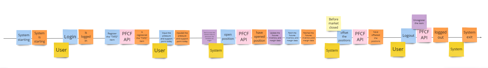
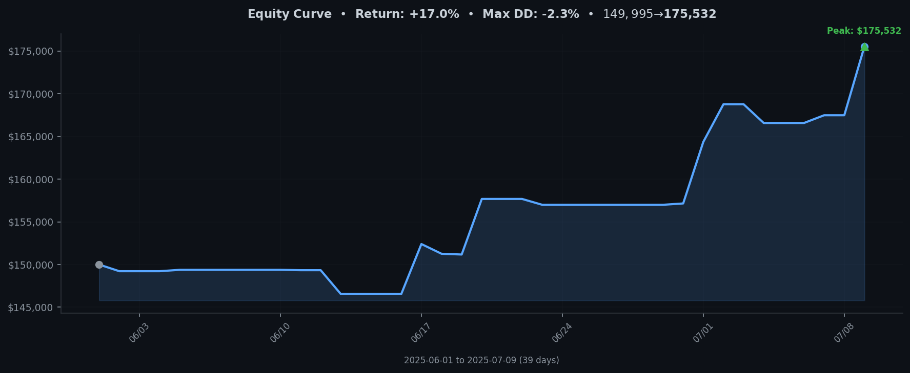

# Futures trading machine

<p align="center">

</p>

## Description

Documentation is still in progress. The project is an automatic futures trading machine designed to trade futures
contracts on
every exchange due to Clean Architecture. The first presentation method is using CLI. With Clean Architecture, the
project is testable, scalable, and flexible to add new features and exchanges.

## Project Overview

This section provides a concise overview of the system architecture, core runtime components, and communication flows.

### Architecture Layers
- **Service layer**: PortCheckerService, GatewayInitializerService, ProcessManagerService
- **UseCase layer**: RunGatewayUseCase, StartStrategyUseCase, StartOrderExecutorUseCase, ApplicationStartupStatusUseCase
- **Controller layer**: CLI controllers (e.g. UserLoginController, AllInOneController)

### Runtime Processes
- **Gateway Process**: Interfaces with the PFCF exchange API, generates `TickEvent`s and publishes them over ZeroMQ PUB (port 5555).
- **Strategy Process**: Subscribes to ticks via ZeroMQ SUB (port 5555), applies `SupportResistanceStrategy`, and pushes `TradingSignal`s via ZeroMQ PUSH (port 5556).
- **Order Executor Process**: Binds a ZeroMQ PULL socket (port 5556) to receive signals, deserializes `TradingSignal`s, and executes market orders via `SendMarketOrderUseCase`.

### Communication Flow
1. Gateway → **PUB** (ticks) → Strategy
2. Strategy → **PUSH** (signals) → Order Executor
3. Order Executor → Exchange API (orders)

### CLI Entry Point
- `app.py` initializes shared services, repositories, and registers CLI commands.
- Selecting option `10` (AllInOneController) launches Gateway, Strategy, and OrderExecutor in the background, returning control to the CLI.

This version utilizes ZeroMQ for Inter-Process Communication (IPC), enabling a more distributed and potentially lower-latency architecture compared to a purely in-process event dispatcher model.

## Test Coverage

The test coverage tag for the project is as follows:


## Quick Start

### Prerequisites
- Python 3.x
- Dependencies: install via `poetry install` (or `pip install -r requirements.txt`).

### Running the Application
```bash
python app.py
```

### CLI Menu Options
| Option | Description                                                                         |
| ------ | ----------------------------------------------------------------------------------- |
| 0      | Exit the application                                                                |
| 1      | User Login                                                                          |
| 2      | User Logout                                                                         |
| 3      | Register Item (select the futures contract to trade)                                |
| 4      | Create Condition (define trading conditions)                                        |
| 5      | Select Order Account (choose account for sending orders)                            |
| 6      | Send Market Order (place manual market orders)                                      |
| 7      | Show Futures (display available futures with current prices)                        |
| 10     | Start All-in-One System (start Gateway, Strategy, and Order Executor in background) |

### All-in-One System Startup
After selecting option `10`, the controller will verify prerequisites:
- User is logged in
- Item is registered
- Order account is selected
- At least one trading condition is defined

If requirements are met, it will:
1. Start the Gateway in a background thread
2. Start the Strategy process
3. Start the Order Executor process
4. Return to the CLI menu while components run in the background
5. Automatically clean up all processes on application exit

## Event Storming

The event storming diagram for the project is as follows:



Updated Link on Miro: [Event Storming](https://miro.com/app/board/uXjVKbXfevY=/?share_link_id=268562178581)


# Futures Trading System Component Relationship Document (ZeroMQ Architecture)

## 1. System Architecture Overview

The futures trading system adopts a distributed, event-driven architecture using ZeroMQ for communication between core processes. The main components run in separate processes: Gateway (Handles API interaction), Strategy Engine, and Order Executor.

```
┌───────────────────────┐       ┌────────────────────────────┐        ┌───────────────────────────┐
│     Gateway Process   │       │     Strategy Process(es)   │        │   Order Executor Process  │
│                       │       │                            │        │                           │
│ ┌───────────────────┐ │ ZMQ   │ ┌──────────────────────┐ │ ZMQ   │ ┌───────────────────────┐ │
│ │  PFCF API Client  │ │──────▶│ │   ZMQ Tick Subscriber│ │──────▶│ │  ZMQ Signal Puller    │ │
│ └─────────┬─────────┘ │(Tick) │ └──────────┬───────────┘ │(Signal)│ └──────────┬────────────┘ │
│           │           │ (PUB) │            │             │ (PUSH) │            │              │
│           │ Raw Data  │       │            │ TickEvent   │        │            │ Signal       │
│           ▼           │       │            ▼             │        │            ▼              │
│ ┌───────────────────┐ │       │ ┌──────────────────────┐ │        │ ┌───────────────────────┐ │
│ │   TickProducer    ├─┼───────┤ │ SupportResistance    ├─┼────────┤ │     OrderExecutor     │ │
│ │ (Publishes Ticks) │ │       │ │ Strategy (Pushes Sig)│ │        │ │ (Executes Orders)     │ │
│ └───────────────────┘ │       │ └──────────┬───────────┘ │        │ └──────────┬────────────┘ │
│                       │       │            │             │        │            │              │
│                       │       │            │ Condition   │        │            │ Order Cmd    │
│                       │       │            │ Repository  │        │            ▼              │
│                       │       │            │ Interaction │        │ ┌───────────────────────┐ │
│                       │       │            └─────────────┘        │ │ SendMarketOrderUseCase│ │
│                       │       │                            │        │ └───────────────────────┘ │
└───────────────────────┘       └────────────────────────────┘        └───────────────────────────┘
        │                                                                         │
        └─────────────────────────────────── External Systems ────────────────────┘
                         (Exchange API, Condition Database, Session Repo)

```
*Note: Condition Repository and Session Repository interactions are simplified in the diagram.*

## 2. Core Components and Relationships (ZeroMQ Context)

### 2.1 Gateway Process (Containing `StartController` and `TickProducer`)

**Role**: Interacts with the external exchange API (PFCF), produces standardized tick events, and publishes them via ZeroMQ.
**Components**:
  - `StartController`: Initializes gateway components, ZMQ sockets (PUB for ticks), connects API callbacks.
  - `TickProducer`: Receives raw market data from PFCF API callbacks, converts data into `TickEvent` objects, serializes them using `msgpack`, and publishes them on a ZMQ PUB socket.

**Relationships**:
- `StartController` initializes `TickProducer` and the ZMQ PUB socket.
- `TickProducer` receives data from the API client (via callbacks registered by `StartController`).
- `TickProducer` publishes serialized `TickEvent` messages via the `ZmqPublisher`.

**Data Flow**:
1. PFCF API Callback → `TickProducer.handle_tick_data()` → Create `TickEvent`
2. `TickEvent` → `serialize()` → `ZmqPublisher.publish(TICK_TOPIC, serialized_event)`

**Code Example (`TickProducer`)**:
```python
def handle_tick_data(self, commodity_id, ...):
    # Create TickEvent
    tick_event = TickEvent(datetime.now(), tick)
    # Serialize and publish via ZMQ
    serialized_event = serialize(tick_event)
    self.tick_publisher.publish(TICK_TOPIC, serialized_event)
```

### 2.2 Strategy Process (Containing `SupportResistanceStrategy`)

**Role**: Subscribes to tick data via ZeroMQ, applies trading logic based on conditions, and pushes trading signals via ZeroMQ.
**Components**:
  - `ZmqSubscriber`: Connects to the Gateway's ZMQ PUB socket and subscribes to `TICK_TOPIC`.
  - `SupportResistanceStrategy`: Receives deserialized `TickEvent`s, interacts with `ConditionRepository`, applies logic, and if conditions are met, creates `TradingSignal` objects.
  - `ZmqPusher`: Serializes `TradingSignal` objects using `msgpack` and sends them via a ZMQ PUSH socket.

**Relationships**:
- Runs in a loop, polling the `ZmqSubscriber` for new ticks.
- Deserializes received tick messages.
- Passes `TickEvent` to `SupportResistanceStrategy.process_tick_event()`.
- If `_send_trading_signal` is called within the strategy, it serializes the signal and uses the injected `ZmqPusher` to send it.

**Data Flow**:
1. `ZmqSubscriber.receive()` → `deserialize()` → `TickEvent`
2. `TickEvent` → `Strategy.process_tick_event()` → Apply Logic
3. If Signal: Create `TradingSignal` → `serialize()` → `ZmqPusher.send(serialized_signal)`

**Code Example (`SupportResistanceStrategy`)**:
```python
def _send_trading_signal(self, action: OrderOperation, tick_event: TickEvent):
    signal = TradingSignal(...)
    try:
        serialized_signal = serialize(signal)
        self.signal_pusher.send(serialized_signal) # Use injected pusher
    except Exception as e:
        # ... error logging ...
```

### 2.3 Order Executor Process (Containing `OrderExecutor`)

**Role**: Receives trading signals via ZeroMQ and executes orders through the appropriate use cases.
**Components**:
  - `ZmqPuller`: Binds a ZMQ PULL socket to receive signals from the Strategy process(es).
  - `OrderExecutor`: Receives deserialized `TradingSignal` objects, interacts with `SessionRepository`, and uses `SendMarketOrderUseCase` to place orders.

**Relationships**:
- Runs in a loop, polling the `ZmqPuller` for new signals.
- Deserializes received signal messages.
- Calls `OrderExecutor.process_received_signal()` which handles the deserialized signal and triggers the `SendMarketOrderUseCase`.

**Data Flow**:
1. `ZmqPuller.receive()` → `deserialize()` → `TradingSignal`
2. `TradingSignal` → `OrderExecutor.process_received_signal()` → Create DTO
3. DTO → `SendMarketOrderUseCase.execute()` → Interact with Exchange API (via Session/Config)

**Code Example (`OrderExecutor`)**:
```python
def process_received_signal(self) -> bool:
    serialized_signal = self.signal_puller.receive(non_blocking=True)
    if serialized_signal:
        try:
            signal: TradingSignal = deserialize(serialized_signal)
            # ... validation ...
            input_dto = SendMarketOrderInputDto(...)
            self.send_order_use_case.execute(input_dto)
            # ... logging ...
            return True
        except Exception as e:
            # ... error handling ...
            return True
    return False # No signal received
```

### 2.4 ZeroMQ Messaging Infrastructure (`src/infrastructure/messaging`)

**Role**: Provides reusable classes for ZMQ communication and serialization.
**Components**:
  - `ZmqPublisher`, `ZmqSubscriber`, `ZmqPusher`, `ZmqPuller`: Wrappers around ZMQ sockets for specific patterns (PUB/SUB, PUSH/PULL).
  - `serializer.py`: Contains `serialize` and `deserialize` functions using `msgpack` with custom handlers for types like `datetime` and `Enum`.

**Relationships**: These components are injected into the core application components (`TickProducer`, `Strategy`, `OrderExecutor`) to handle communication.

## 3. Detailed Data Flow (ZeroMQ)

### 3.1 Tick Data Flow

1. **Market Data Reception (Gateway)**:
   ```
   PFCF API Callback → TickProducer.handle_tick_data()
   ```
2. **Tick Publishing (Gateway)**:
   ```
   TickProducer → Create TickEvent → serialize() → ZmqPublisher.publish(TICK_TOPIC)
   ```
3. **Tick Reception (Strategy)**:
   ```
   ZmqSubscriber.receive() → deserialize() → TickEvent
   ```
4. **Strategy Processing (Strategy)**:
   ```
   TickEvent → Strategy.process_tick_event() → Analyze conditions
   ```

### 3.2 Trading Signal Flow

1. **Signal Generation (Strategy)**:
   ```
   Strategy → Conditions met → Create TradingSignal → serialize()
   ```
2. **Signal Sending (Strategy)**:
   ```
   serialized_signal → ZmqPusher.send()
   ```
3. **Signal Reception (Order Executor)**:
   ```
   ZmqPuller.receive() → deserialize() → TradingSignal
   ```
4. **Order Execution Trigger (Order Executor)**:
   ```
   TradingSignal → OrderExecutor.process_received_signal() → SendMarketOrderUseCase.execute()
   ```

## 4. Key Design Decisions

### 4.1 Use of ZeroMQ for Inter-Process Communication

- **Decision**: Replaced the in-process `RealtimeDispatcher` with ZeroMQ for communication between the Gateway, Strategy, and Order Execution components.
- **Rationale**:
    - Enables a multi-process architecture, bypassing Python's GIL limitations for better parallelism and potentially lower latency.
    - Decouples components, improving modularity and fault isolation.
    - Aligns with common patterns in distributed trading systems.
    - ZeroMQ is known for its high performance and low latency characteristics.
- **Patterns**:
    - **PUB/SUB** for Tick Data: Allows one Gateway (`TickProducer`) to broadcast ticks to multiple Strategy instances efficiently.
    - **PUSH/PULL** for Trading Signals: Provides a load-balancing/queueing mechanism from potentially multiple Strategy instances (`ZmqPusher`) to a single `OrderExecutor` (`ZmqPuller`).
- **Serialization**: `msgpack` chosen for its efficiency over JSON. Custom handlers implemented for `datetime` and `Enum`.

### 4.2 Removal of Internal Buffering and Scheduling in Gateway

- **Decision**: Removed the `FifoQueueEventSource` buffer and the `schedule` based processing from `TickProducer` and `StartController`.
- **Rationale**: With ZeroMQ, the transport layer itself provides buffering capabilities. Ticks are published immediately upon generation. Backpressure handling (if needed) would occur at the ZMQ socket level or within the receiving processes. This simplifies the Gateway and reduces potential in-process latency introduced by scheduled batch processing.

### 4.3 Component Responsibilities

- **Gateway (`StartController`, `TickProducer`)**: Focuses solely on API interaction and publishing market data.
- **Strategy (`SupportResistanceStrategy`)**: Focuses on consuming market data, applying logic, and producing signals.
- **Order Executor (`OrderExecutor`)**: Focuses on consuming signals and executing trades via use cases.

This clear separation aligns with Clean Architecture and Single Responsibility Principle.

## 5. Dependency Analysis

Dependencies are managed via ZeroMQ interfaces:

- **Gateway** publishes ticks; does not know about subscribers.
- **Strategy** subscribes to ticks (depends on Gateway's tick address/topic) and pushes signals (depends on Executor's signal address).
- **Order Executor** pulls signals (depends on its own bound address); does not know about signal pushers.

Core domain/use case layers remain independent of the ZMQ infrastructure layer, which is injected where needed.

## 6. System Configuration Parameters

Important system parameters and their default values:

| Parameter                     | Default Value             | Description                                    | Location                                      |
|-------------------------------|---------------------------|------------------------------------------------|-----------------------------------------------|
| ZMQ_TICK_PUB_ADDRESS          | `tcp://*:5555`            | Address the Tick Publisher binds to            | `start_controller.py`                         |
| ZMQ_SIGNAL_PULL_ADDRESS       | `tcp://*:5556`            | Address the Signal Puller binds to             | `start_controller.py` (Used by OrderExecutor) |
| ZMQ_TICK_SUB_CONNECT_ADDRESS  | `tcp://localhost:5555`    | Address the Tick Subscriber connects to        | Strategy Process Configuration                  |
| ZMQ_SIGNAL_PUSH_CONNECT_ADDRESS| `tcp://localhost:5556`    | Address the Signal Pusher connects to         | Strategy Process Configuration                  |
| ZMQ Poll Timeouts             | 10ms                      | Socket polling timeouts in ZMQ wrappers        | `zmq_subscriber.py`, `zmq_puller.py`          |

These addresses and timeouts should ideally be loaded from a configuration file or environment variables.

## 7. Conclusion

The refactored system uses ZeroMQ for inter-process communication, creating a more distributed and potentially performant architecture. Key benefits include:

1. **Improved Parallelism**: Bypasses the Python GIL by running components in separate processes.
2. **Lower Latency Potential**: Reduces in-process bottlenecks and leverages ZeroMQ's efficiency.
3. **Enhanced Modularity**: Components are decoupled and communicate via defined message queues.
4. **Scalability**: Strategy instances can potentially be scaled horizontally.

This architecture adheres to Clean Architecture and SOLID principles, promoting maintainability, testability, and flexibility, while taking a step towards handling higher frequency event streams. However, it introduces the complexity of managing multiple processes and the ZeroMQ infrastructure.


## 8. Equity trend chart

This is the daily change in equity
<!-- GRAPH START -->

<!-- GRAPH END -->
