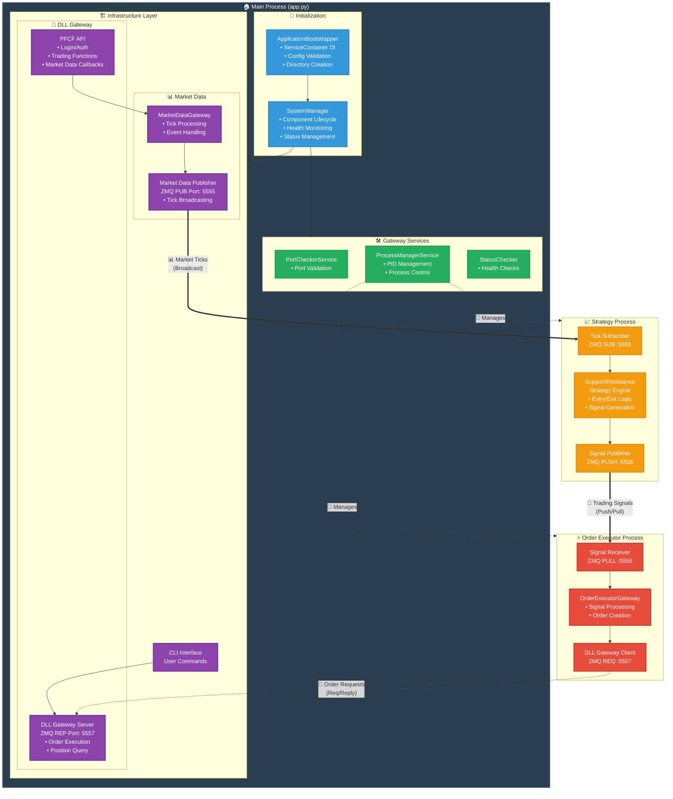
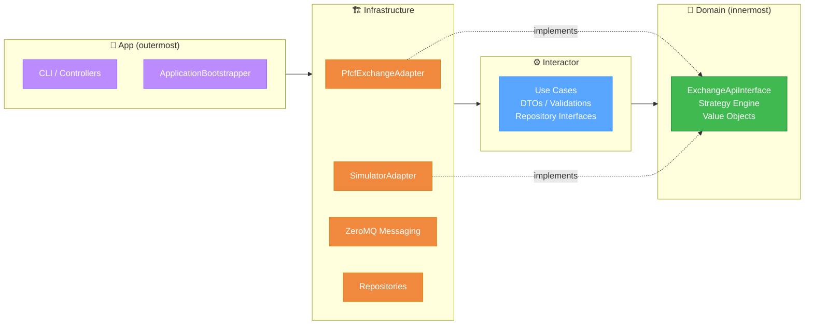
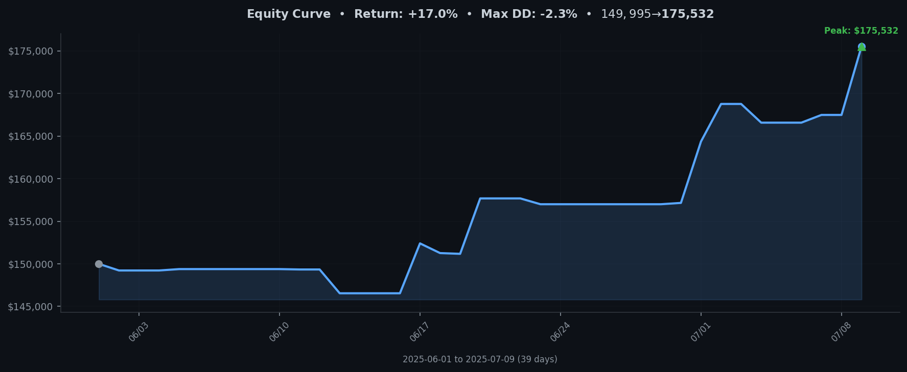

# 🚀 Auto Futures Trading Machine

<p align="center">

</p>

<p align="center">
  
  
  
  
  
</p>

> **Taiwan Futures Automated Trading System - Designed for PFCF (統一期貨)**
> A distributed, event-driven futures trading platform built with Python and ZeroMQ

## 📖 Table of Contents

### 🎯 Getting Started
- [**Quick Start Guide**](docs/getting-started/QUICK_START.md) - Get up and running with Taiwan Unified Futures (PFCF)
- [**Installation Guide**](docs/getting-started/INSTALLATION.md) - Detailed setup instructions
- [**First Trade Tutorial**](docs/getting-started/FIRST_TRADE.md) - Your first automated trade with support/resistance strategy

### 🏗️ Architecture & Design
- [**Class Design Guide**](docs/architecture/CLASS_DESIGN_GUIDE.md) - SOLID principles and Clean Architecture implementation
- [**Detailed Flow Diagrams**](docs/architecture/DETAILED_FLOW_DIAGRAMS.md) - Process flows and system interactions
- [**DLL Porting Guide**](docs/architecture/DLL_PORTING_GUIDE.md) - How to migrate from PFCF to other brokers

### 🔧 Technical Deep Dives
- [**Why ZeroMQ?**](docs/technical/WHY_ZEROMQ.md) - Message patterns and performance analysis
- [**Process Communication**](docs/technical/PROCESS_COMMUNICATION.md) - IPC patterns explained
- [**High-Frequency Trading Concepts**](docs/technical/HFT_CONCEPTS.md) - What we borrowed from HFT

### 📚 Implementation Guides
- [**AllInOne Controller Guide**](docs/guides/ALLINONE_CONTROLLER_GUIDE.md) - Complete startup process and data flow
- [**Strategy Expansion Guide**](docs/guides/STRATEGY_EXPANSION_GUIDE.md) - How to add new trading strategies
- [**Backtesting Guide**](docs/guides/BACKTESTING.md) - Testing your strategies
- [**Monitoring Guide**](docs/guides/MONITORING.md) - System monitoring and alerts

### 🔍 Developer Stories
- [**Design Decisions**](docs/stories/DESIGN_DECISIONS.md) - Why we made the choices we did
- [**Lessons Learned**](docs/stories/LESSONS_LEARNED.md) - What worked and what didn't

### 📋 Configuration & Reference
- [**Configuration Guide**](docs/CONFIG_GUIDE.md) - System configuration options
- [**Roadmap**](docs/ROADMAP.md) - Project evolution and future plans
- [**Architecture Decision Records**](docs/decisions/) - Key architectural choices

---

## 🎬 About This System

**This is not a generic trading system.** This platform is specifically designed for **Taiwan Unified Futures (PFCF)** and is tightly coupled to their proprietary Python DLL API.

### 🏆 What Makes This Special?

### 🔐 **Security First**
We eliminated plaintext credential storage and centralized all exchange API access through a secure DLL Gateway - a pattern inspired by institutional trading systems.

### ⚡ **Event-Driven Architecture**
Every market tick, every trading signal, every order - they're all events flowing through our system via ZeroMQ, enabling true parallelism and bypassing Python's GIL.

### 🧩 **Clean Architecture**
SOLID principles aren't just theory here. Our system demonstrates how proper separation of concerns transforms maintainability with clear boundaries between domain, application, and infrastructure layers.

### 📊 **Production Ready**
From comprehensive test coverage to graceful error handling, this isn't just a prototype - it's a system designed for real trading with Taiwan futures markets.

## 🚀 Quick Start

```bash
# Clone the repository
git clone https://github.com/ttpss930141011/auto-futures-trading-machine.git
cd auto-futures-trading-machine

# Install dependencies
poetry install

# Configure your PFCF credentials
cp .env.example .env
# Edit .env with your Taiwan Unified Futures credentials

# Run the system
python app.py
```

**Important**: You must be a Taiwan Unified Futures customer with API access. Follow our [Quick Start Guide](docs/getting-started/QUICK_START.md) for detailed instructions.

## 🏛️ System Architecture at a Glance


```mermaid
graph TB
    %% Main Process Components
    subgraph MainProcess["🏠 Main Process (app.py)"]
        direction TB
        
        subgraph Bootstrap["🚀 Initialization"]
            AB[ApplicationBootstrapper<br/>• ServiceContainer DI<br/>• Config Validation<br/>• Directory Creation]
            SM[SystemManager<br/>• Component Lifecycle<br/>• Health Monitoring<br/>• Status Management]
        end
        
        subgraph Infrastructure["🏗️ Infrastructure Layer"]
            CLI[CLI Interface<br/>User Commands]
            
            subgraph DLLGateway["🔐 DLL Gateway"]
                DGS[DLL Gateway Server<br/>ZMQ REP Port: 5557<br/>• Order Execution<br/>• Position Query]
                PFCFAPI[PFCF API<br/>• Login/Auth<br/>• Trading Functions<br/>• Market Data Callbacks]
            end
            
            subgraph MarketData["📊 Market Data"]
                MDP[Market Data Publisher<br/>ZMQ PUB Port: 5555<br/>• Tick Broadcasting]
                MDG[MarketDataGateway<br/>• Tick Processing<br/>• Event Handling]
            end
        end
        
        subgraph Services["🛠️ Gateway Services"]
            PC[PortCheckerService<br/>• Port Validation]
            PM[ProcessManagerService<br/>• PID Management<br/>• Process Control]
            SC[StatusChecker<br/>• Health Checks]
        end
        
        AB --> SM
        SM --> Services
        SM --> Infrastructure
        PFCFAPI --> MDG
        MDG --> MDP
        CLI --> DGS
    end
    
    %% Strategy Process
    subgraph StrategyProcess["📈 Strategy Process"]
        direction LR
        TS[Tick Subscriber<br/>ZMQ SUB :5555]
        SRS[Support/Resistance<br/>Strategy Engine<br/>• Entry/Exit Logic<br/>• Signal Generation]
        SP[Signal Publisher<br/>ZMQ PUSH :5556]
        
        TS --> SRS
        SRS --> SP
    end
    
    %% Order Executor Process
    subgraph OrderExecutor["⚡ Order Executor Process"]
        direction LR
        SR[Signal Receiver<br/>ZMQ PULL :5556]
        OEG[OrderExecutorGateway<br/>• Signal Processing<br/>• Order Creation]
        DGC[DLL Gateway Client<br/>ZMQ REQ :5557]
        
        SR --> OEG
        OEG --> DGC
    end
    
    %% Data Flow Connections
    MDP ===>|"📊 Market Ticks<br/>(Broadcast)"| TS
    SP ===>|"📨 Trading Signals<br/>(Push/Pull)"| SR
    DGC -.->|"📝 Order Requests<br/>(Req/Reply)"| DGS
    
    %% Process Management
    PM -.->|"🔧 Manages"| StrategyProcess
    PM -.->|"🔧 Manages"| OrderExecutor
    
    %% Styling - 改善配色方案
    classDef mainBox fill:#2c3e50,stroke:#34495e,stroke-width:3px,color:#fff
    classDef bootstrap fill:#3498db,stroke:#2980b9,stroke-width:2px,color:#fff
    classDef infrastructure fill:#8e44ad,stroke:#662d91,stroke-width:2px,color:#fff
    classDef services fill:#27ae60,stroke:#229954,stroke-width:2px,color:#fff
    classDef strategy fill:#f39c12,stroke:#d68910,stroke-width:2px,color:#fff
    classDef executor fill:#e74c3c,stroke:#c0392b,stroke-width:2px,color:#fff
    classDef dataflow stroke:#3498db,stroke-width:3px,stroke-dasharray: 5 5
    
    class MainProcess mainBox
    class AB,SM bootstrap
    class CLI,DGS,PFCFAPI,MDP,MDG infrastructure
    class PC,PM,SC services
    class TS,SRS,SP strategy
    class SR,OEG,DGC executor
```

### 🧅 Clean Architecture — Dependency Rule

The inner layers define interfaces; outer layers implement them. Dependencies always point **inward**.


```mermaid
graph LR
    subgraph Domain["🎯 Domain (innermost)"]
        DI[ExchangeApiInterface<br/>Strategy Engine<br/>Value Objects]
    end

    subgraph Interactor["⚙️ Interactor"]
        UC[Use Cases<br/>DTOs / Validations<br/>Repository Interfaces]
    end

    subgraph Infra["🏗️ Infrastructure"]
        PA[PfcfExchangeAdapter]
        SA[SimulatorAdapter]
        ZMQ[ZeroMQ Messaging]
        REPO[Repositories]
    end

    subgraph App["📱 App (outermost)"]
        CLI[CLI / Controllers]
        BOOT[ApplicationBootstrapper]
    end

    App --> Infra --> Interactor --> Domain
    PA -.->|implements| DI
    SA -.->|implements| DI

    classDef domain fill:#3fb950,stroke:#238636,color:#fff
    classDef interactor fill:#58a6ff,stroke:#388bfd,color:#fff
    classDef infra fill:#f0883e,stroke:#d18616,color:#fff
    classDef app fill:#bc8cff,stroke:#8b5cf6,color:#fff

    class DI domain
    class UC interactor
    class PA,SA,ZMQ,REPO infra
    class CLI,BOOT app
```

> **Exchange adapters are pluggable.** Swap `PfcfExchangeAdapter` for `SimulatorAdapter` (included) or implement your own broker adapter — zero changes to domain or use case logic.

### 📊 **Key Architectural Improvements**

- **🏗️ Dependency Injection**: ServiceContainer centralizes all dependencies
- **🔌 Exchange Abstraction**: `ExchangeApiInterface` with pluggable adapters (PFCF, Simulator)
- **🔄 Component Status**: Enum-based status tracking (STOPPED → STARTING → RUNNING → STOPPING → ERROR)  
- **🛡️ Gateway Services**: Dedicated layer for infrastructure services (Port checking, Market data gateway, Process management)
- **📋 PID Management**: ProcessManagerService handles process lifecycle with PID files in tmp/pids/
- **⚡ Health Monitoring**: SystemManager provides real-time health checks and uptime tracking

## 📈 Performance Metrics

- **Tick Processing**: < 1ms latency (ZeroMQ + msgpack serialization)
- **Signal Generation**: < 5ms from tick to trading decision
- **Order Execution**: < 10ms round-trip to exchange
- **Test Coverage**: 95%+ across critical components

## 🎓 Learning Path

Whether you're interested in:
- **System Architecture**: Start with [Class Design Guide](docs/architecture/CLASS_DESIGN_GUIDE.md) for complete system overview
- **Detailed Flows**: Explore [Detailed Flow Diagrams](docs/architecture/DETAILED_FLOW_DIAGRAMS.md) for process flows
- **AllInOne Controller**: Understand [AllInOne Controller Guide](docs/guides/ALLINONE_CONTROLLER_GUIDE.md) for startup process
- **Strategy Development**: Read [Strategy Expansion Guide](docs/guides/STRATEGY_EXPANSION_GUIDE.md) for adding new strategies
- **Distributed Systems**: Read [Why ZeroMQ?](docs/technical/WHY_ZEROMQ.md) for messaging patterns
- **Broker Migration**: Check [DLL Porting Guide](docs/architecture/DLL_PORTING_GUIDE.md) for migrating to other brokers

This documentation serves as both a **technical reference** and a **learning resource** for building production-grade trading systems.

## ⚠️ Important Limitations

**Broker Support**: The production adapter targets Taiwan Unified Futures (PFCF) DLL. Other brokers require a new adapter implementing `ExchangeApiInterface` — see our [DLL Porting Guide](docs/architecture/DLL_PORTING_GUIDE.md). A `SimulatorAdapter` is included for development and testing.

**Single Strategy**: Currently supports only the right-side entry support/resistance strategy. See [Strategy Expansion Guide](docs/guides/STRATEGY_EXPANSION_GUIDE.md) to add more strategies.

## 📜 License

This project is licensed under the MIT License - see the [LICENSE](LICENSE) file for details.

## 🙏 Acknowledgments

This project stands on the shoulders of giants:
- The **ZeroMQ** community for incredible messaging patterns
- **Clean Architecture** principles by Robert C. Martin
- High-frequency trading system designs that inspired our architecture
- Taiwan Unified Futures for providing the API access

## 📈 Live Trading Results

Real equity curve from live trading on Taiwan futures (June–July 2025):

<!-- GRAPH START -->

<!-- GRAPH END -->

| Metric | Value |
|--------|-------|
| Period | 2025-06-01 → 2025-07-09 (39 days) |
| Return | **+17.0%** |
| Max Drawdown | **-2.3%** |
| Starting Equity | $149,995 |
| Peak Equity | $175,532 |

> Chart generated by [`scripts/generate_equity_chart.py`](scripts/generate_equity_chart.py) from [`equity_log.csv`](equity_log.csv). Re-run after updating the CSV to refresh.

---

*"In trading, as in software, the best systems are those that are simple to understand, yet sophisticated in their execution."*

**Ready to dive in?** Start with our [Quick Start Guide](docs/getting-started/QUICK_START.md) →
