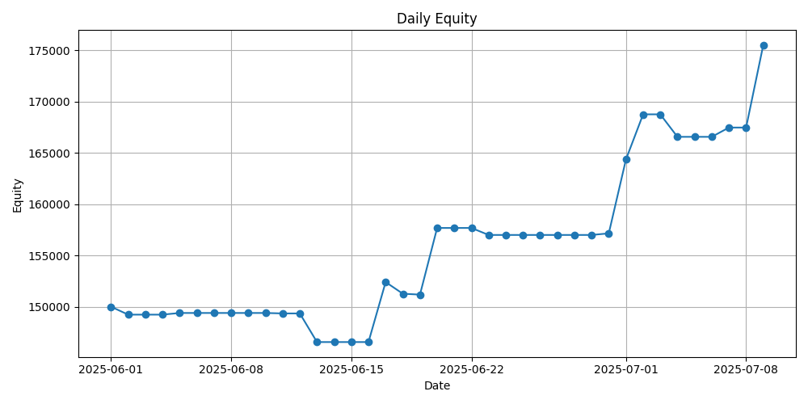

# 🚀 Auto Futures Trading Machine

<p align="center">

</p>

<p align="center">
  
  
  
  
  
</p>

> **Taiwan Futures Automated Trading System - Designed for PFCF (統一期貨)**  
> A distributed, event-driven futures trading platform built with Python and ZeroMQ

## 📖 Table of Contents

### 🎯 Getting Started
- [**Quick Start Guide**](docs/getting-started/QUICK_START.md) - Get up and running with Taiwan Unified Futures (PFCF)
- [**Installation Guide**](docs/getting-started/INSTALLATION.md) - Detailed setup instructions
- [**First Trade Tutorial**](docs/getting-started/FIRST_TRADE.md) - Your first automated trade with support/resistance strategy

### 🏗️ Architecture & Design
- [**Class Design Guide**](docs/architecture/CLASS_DESIGN_GUIDE.md) - SOLID principles and Clean Architecture implementation
- [**Detailed Flow Diagrams**](docs/architecture/DETAILED_FLOW_DIAGRAMS.md) - Process flows and system interactions
- [**DLL Porting Guide**](docs/architecture/DLL_PORTING_GUIDE.md) - How to migrate from PFCF to other brokers

### 🔧 Technical Deep Dives
- [**Why ZeroMQ?**](docs/technical/WHY_ZEROMQ.md) - Message patterns and performance analysis
- [**Process Communication**](docs/technical/PROCESS_COMMUNICATION.md) - IPC patterns explained
- [**High-Frequency Trading Concepts**](docs/technical/HFT_CONCEPTS.md) - What we borrowed from HFT

### 📚 Implementation Guides
- [**AllInOne Controller Guide**](docs/guides/ALLINONE_CONTROLLER_GUIDE.md) - Complete startup process and data flow
- [**Strategy Expansion Guide**](docs/guides/STRATEGY_EXPANSION_GUIDE.md) - How to add new trading strategies
- [**Backtesting Guide**](docs/guides/BACKTESTING.md) - Testing your strategies
- [**Monitoring Guide**](docs/guides/MONITORING.md) - System monitoring and alerts

### 🔍 Developer Stories
- [**Design Decisions**](docs/stories/DESIGN_DECISIONS.md) - Why we made the choices we did
- [**Lessons Learned**](docs/stories/LESSONS_LEARNED.md) - What worked and what didn't

### 📋 Configuration & Reference
- [**Configuration Guide**](docs/CONFIG_GUIDE.md) - System configuration options
- [**Roadmap**](docs/ROADMAP.md) - Project evolution and future plans
- [**Architecture Decision Records**](docs/decisions/) - Key architectural choices

---

## 🎬 About This System

**This is not a generic trading system.** This platform is specifically designed for **Taiwan Unified Futures (PFCF)** and is tightly coupled to their proprietary Python DLL API.

### 🏆 What Makes This Special?

### 🔐 **Security First**
We eliminated plaintext credential storage and centralized all exchange API access through a secure DLL Gateway - a pattern inspired by institutional trading systems.

### ⚡ **Event-Driven Architecture**
Every market tick, every trading signal, every order - they're all events flowing through our system via ZeroMQ, enabling true parallelism and bypassing Python's GIL.

### 🧩 **Clean Architecture**
SOLID principles aren't just theory here. Our system demonstrates how proper separation of concerns transforms maintainability with clear boundaries between domain, application, and infrastructure layers.

### 📊 **Production Ready**
From comprehensive test coverage to graceful error handling, this isn't just a prototype - it's a system designed for real trading with Taiwan futures markets.

## 🚀 Quick Start

```bash
# Clone the repository
git clone https://github.com/ttpss930141011/auto-futures-trading-machine.git
cd auto-futures-trading-machine

# Install dependencies
poetry install

# Configure your PFCF credentials
cp .env.example .env
# Edit .env with your Taiwan Unified Futures credentials

# Run the system
python app.py
```

**Important**: You must be a Taiwan Unified Futures customer with API access. Follow our [Quick Start Guide](docs/getting-started/QUICK_START.md) for detailed instructions.

## 🏛️ System Architecture at a Glance

```
┌─────────────────────────────────────────────────────────────────────────────┐
│                           Main Process (app.py)                             │
│  ┌──────────────────┐  ┌──────────────────┐  ┌───────────────────────────┐  │
│  │ ApplicationBootstrapper                 │  │      SystemManager       │  │
│  │ ├─ ServiceContainer (DI)                │  │  ├─ Component Status     │  │
│  │ ├─ Config Validation                    │  │  ├─ Health Monitoring    │  │
│  │ └─ Directory Creation                   │  │  └─ Lifecycle Management |  │
│  └──────────────────┘  └──────────────────┘  └───────────────────────────┘  │
│          │                      │                          │                │
│          │              ┌───────┴────────┐                 │                │
│          │              │ Gateway Services│                │                │
│          │              │ ├─ PortChecker  │                │                │
│          │              │ ├─ MarketDataGW │────────────────┘                │
│          │              │ └─ ProcessMgr   │                                 │
│          │              └────────────────┘                                  │
│          │                                                                  │  
│          └─────────┬─────────────────┬──────────────────────────────────────┘
│                    │                 │                                      |
│  ┌─────────────────▼───┐  ┌──────────▼─────────┐  ┌─────────────────────┐   |
│  │     CLI Interface   │  │ DLL Gateway Server │  │  Market Data        │   |
│  │   (User Commands)   │  │    Port : 5557     │  │   Publisher         │   |
│  │                     │  │  (Order Execution) │  │   Port : 5555       │   |
│  └─────────────────────┘  └────────────────────┘  └─────────────────────┘   |
└─────────────────────────────────────────────────────────────────────────────┘
                                   ▲                         │
                                   │ ZMQ REQ/REP             │ ZMQ PUB  
                                   │ (Orders)                │ (Market Data)
                                   │                         ▼
                   ┌───────────────┴────────┐         ┌─────────────────┐
                   │   Order Executor       │         │    Strategy     │
                   │     Process            │         │    Process      │
                   │  (PID: order_exec.pid) │         │ (PID: strat.pid)│
                   │                        │         │                 │
                   │ ┌──────────────────┐   │         │ ┌─────────────┐ │
                   │ │   Signal Queue   │   │◄────────┤ │    Tick     │ │
                   │ │   (ZMQ PULL)     │   │  Signals│ │ Subscriber  │ │
                   │ │   Port : 5556    │   │         │ └─────────────┘ │
                   │ └──────────────────┘   │         │                 │
                   │                        │         │  ┌────────────┐ │
                   │ ┌──────────────────┐   │         │  │ Support/   │ │
                   │ │ DLL Gateway      │   │         │  │ Resistance │ │
                   │ │ Client           │   │         │  │ Strategy   │ │
                   │ └──────────────────┘   │         │  └────────────┘ │
                   └────────────────────────┘         └─────────────────┘
                                                         │
                                                         ▼ ZMQ PUSH
                                                   (Trading Signals)
```

### 📊 **Key Architectural Improvements**

- **🏗️ Dependency Injection**: ServiceContainer centralizes all dependencies
- **🔄 Component Status**: Enum-based status tracking (STOPPED → STARTING → RUNNING → STOPPING → ERROR)  
- **🛡️ Gateway Services**: Dedicated layer for infrastructure services (Port checking, Market data gateway, Process management)
- **📋 PID Management**: ProcessManagerService handles process lifecycle with PID files in tmp/pids/
- **⚡ Health Monitoring**: SystemManager provides real-time health checks and uptime tracking

## 📈 Performance Metrics

- **Tick Processing**: < 1ms latency (ZeroMQ + msgpack serialization)
- **Signal Generation**: < 5ms from tick to trading decision
- **Order Execution**: < 10ms round-trip to exchange
- **Test Coverage**: 95%+ across critical components

## 🎓 Learning Path

Whether you're interested in:
- **System Architecture**: Start with [Class Design Guide](docs/architecture/CLASS_DESIGN_GUIDE.md) for complete system overview
- **Detailed Flows**: Explore [Detailed Flow Diagrams](docs/architecture/DETAILED_FLOW_DIAGRAMS.md) for process flows
- **AllInOne Controller**: Understand [AllInOne Controller Guide](docs/guides/ALLINONE_CONTROLLER_GUIDE.md) for startup process
- **Strategy Development**: Read [Strategy Expansion Guide](docs/guides/STRATEGY_EXPANSION_GUIDE.md) for adding new strategies
- **Distributed Systems**: Read [Why ZeroMQ?](docs/technical/WHY_ZEROMQ.md) for messaging patterns
- **Broker Migration**: Check [DLL Porting Guide](docs/architecture/DLL_PORTING_GUIDE.md) for migrating to other brokers

This documentation serves as both a **technical reference** and a **learning resource** for building production-grade trading systems.

## ⚠️ Important Limitations

**Broker Dependency**: This system is highly coupled to Taiwan Unified Futures (PFCF) DLL. If you need to migrate to other brokers like Yuanta Securities or Capital Futures, refer to our [DLL Porting Guide](docs/architecture/DLL_PORTING_GUIDE.md).

**Single Strategy**: Currently supports only the right-side entry support/resistance strategy. See [Strategy Expansion Guide](docs/guides/STRATEGY_EXPANSION_GUIDE.md) to add more strategies.

## 📜 License

This project is licensed under the MIT License - see the [LICENSE](LICENSE) file for details.

## 🙏 Acknowledgments

This project stands on the shoulders of giants:
- The **ZeroMQ** community for incredible messaging patterns
- **Clean Architecture** principles by Robert C. Martin
- High-frequency trading system designs that inspired our architecture
- Taiwan Unified Futures for providing the API access

## 8. Equity Trend Chart

This is the daily change in equity
<!-- GRAPH START -->

<!-- GRAPH END -->

---

*"In trading, as in software, the best systems are those that are simple to understand, yet sophisticated in their execution."*

**Ready to dive in?** Start with our [Quick Start Guide](docs/getting-started/QUICK_START.md) →
