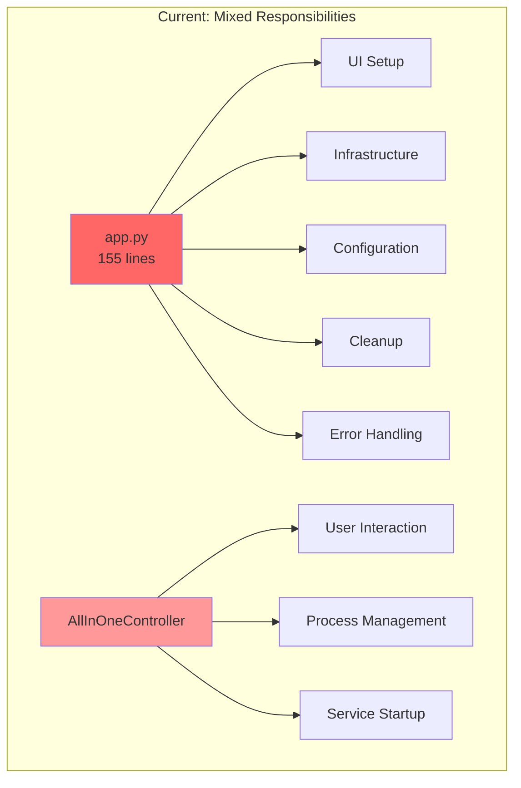
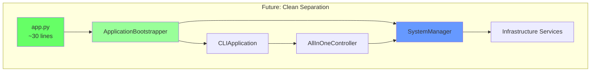
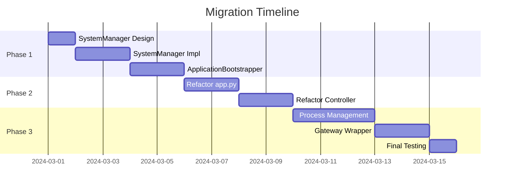

# 📋 Technical Migration Plan: SystemManager Implementation
## Auto Futures Trading Machine - Responsibility Separation & Clean Architecture

---

## 📋 Executive Summary

This migration addresses critical architectural issues in the current system where responsibilities are poorly separated, violating SOLID principles and Clean Architecture patterns. The main problems are concentrated in `app.py` and `AllInOneController`, which handle too many disparate concerns.

**Migration Goal**: Implement proper separation of concerns with a dedicated `SystemManager` to handle infrastructure lifecycle while keeping application controllers focused on user interaction.

---

## 🎯 Problems Being Solved

### **Current Architecture Issues**

| Issue | Impact | Severity |
|-------|--------|----------|
| **Mixed Layer Dependencies** | Application Layer directly manages Infrastructure | 🔴 Critical |
| **Single Responsibility Violation** | `app.py` handles 6+ distinct responsibilities | 🔴 Critical |
| **Tight Coupling** | Hard to test, modify, or extend | 🟡 Medium |
| **Resource Management Scattered** | Cleanup logic spread across multiple files | 🟡 Medium |

---

## 📊 Current vs Future Architecture

### **Current State Diagram**


### **Future State Diagram**


---

## 🔄 Detailed Migration Plan

### **Phase 1: Infrastructure Layer Separation**

#### **Work Item 1.1: Create SystemManager**
```python
# 📁 src/infrastructure/services/system_manager.py
class SystemManager:
    """Centralized infrastructure service management."""
    
    def start_trading_system(self) -> SystemStartupResult
    def stop_trading_system(self) -> None  
    def get_system_health(self) -> SystemHealth
    def restart_component(self, component: str) -> bool
```

**Deliverables:**
- [ ] SystemManager interface design
- [ ] SystemStartupResult DTO
- [ ] SystemHealth DTO  
- [ ] Unit tests for SystemManager

**Estimated Time:** 3 days

#### **Work Item 1.2: Create ApplicationBootstrapper**
```python
# 📁 src/app/bootstrap/application_bootstrapper.py
class ApplicationBootstrapper:
    """Handles dependency injection and initialization sequence."""
    
    def bootstrap(self) -> BootstrapResult
    def create_service_container(self) -> ServiceContainer
    def validate_configuration(self) -> ValidationResult
```

**Deliverables:**
- [ ] ApplicationBootstrapper implementation
- [ ] Configuration validation logic
- [ ] Dependency injection setup
- [ ] Integration tests

**Estimated Time:** 2 days

---

### **Phase 2: Application Layer Refactoring**

#### **Work Item 2.1: Refactor app.py**

**Before (Current):**
```python
# ❌ app.py - Too many responsibilities
def main():
    # 1. Setup DLL Gateway
    # 2. Create CLI controllers  
    # 3. Handle exceptions
    # 4. Manage cleanup
    # 5. Create directories
    # 6. Initialize everything
```

**After (Target):**
```python
# ✅ app.py - Single responsibility  
def main():
    bootstrapper = ApplicationBootstrapper()
    result = bootstrapper.bootstrap()
    
    if result.success:
        cli_app = CLIApplication(result.system_manager)
        cli_app.run()
```

**Deliverables:**
- [ ] Simplified app.py (< 30 lines)
- [ ] All responsibilities moved to appropriate layers
- [ ] Backward compatibility maintained
- [ ] End-to-end tests pass

**Estimated Time:** 2 days

#### **Work Item 2.2: Refactor AllInOneController**

**Before (Current):**
```python
# ❌ AllInOneController - Mixed concerns
def execute(self):
    # 1. UI interaction
    # 2. Process management  
    # 3. Infrastructure startup
    # 4. Resource cleanup
```

**After (Target):**
```python
# ✅ AllInOneController - UI focused
def execute(self):
    # 1. User validation
    # 2. Display prerequisites  
    # 3. Delegate to SystemManager
    # 4. Show results
    result = self.system_manager.start_trading_system()
    self.display_results(result)
```

**Deliverables:**
- [ ] AllInOneController refactored
- [ ] UI logic separated from infrastructure
- [ ] System integration through SystemManager
- [ ] User experience unchanged

**Estimated Time:** 2 days

---

### **Phase 3: Service Layer Enhancement**

#### **Work Item 3.1: Enhanced Process Management**

```python
# 📁 src/infrastructure/services/process/enhanced_process_manager.py
class EnhancedProcessManager:
    """Enhanced process lifecycle management."""
    
    def start_strategy_process(self) -> ProcessResult
    def start_order_executor_process(self) -> ProcessResult
    def monitor_process_health(self) -> HealthStatus
    def restart_failed_process(self, process_id: str) -> bool
```

**Deliverables:**
- [ ] Process health monitoring
- [ ] Automatic restart capability
- [ ] Better error reporting
- [ ] Process metrics collection

**Estimated Time:** 3 days

#### **Work Item 3.2: Gateway Service Wrapper**

```python
# 📁 src/infrastructure/services/gateway/gateway_service_wrapper.py
class GatewayServiceWrapper:
    """Wraps DLL Gateway with service interface."""
    
    def start_gateway(self) -> ServiceResult
    def stop_gateway(self) -> ServiceResult
    def get_gateway_status(self) -> GatewayStatus
    def restart_gateway(self) -> ServiceResult
```

**Deliverables:**
- [ ] Gateway service abstraction
- [ ] Status monitoring
- [ ] Graceful shutdown handling
- [ ] Service health checks

**Estimated Time:** 2 days

---

## 📋 Complete Work Breakdown Structure

### **Phase 1: Infrastructure (7 days)**
```
├── 1.1 SystemManager Creation (3 days)
│   ├── Interface design
│   ├── Core implementation  
│   ├── DTO definitions
│   └── Unit testing
└── 1.2 ApplicationBootstrapper (2 days)
    ├── Dependency injection
    ├── Configuration validation
    └── Integration testing
```

### **Phase 2: Application Refactoring (4 days)**
```
├── 2.1 app.py Simplification (2 days)
│   ├── Responsibility extraction
│   ├── Bootstrap integration
│   └── E2E testing
└── 2.2 AllInOneController Refactor (2 days)
    ├── UI logic isolation
    ├── SystemManager integration
    └── User experience validation
```

### **Phase 3: Service Enhancement (5 days)**
```
├── 3.1 Enhanced Process Management (3 days)
│   ├── Health monitoring
│   ├── Auto-restart logic
│   └── Metrics collection
└── 3.2 Gateway Service Wrapper (2 days)
    ├── Service abstraction
    ├── Status monitoring
    └── Health checks
```

**Total Estimated Time: 16 days**

---

## 🔄 Migration Flow Diagram

```mermaid
graph LR
    subgraph "Week 1"
        A[Start] --> B[SystemManager Design]
        B --> C[SystemManager Implementation]
        C --> D[ApplicationBootstrapper]
    end
    
    subgraph "Week 2"
        D --> E[Refactor app.py]
        E --> F[Refactor AllInOneController]
        F --> G[Integration Testing]
    end
    
    subgraph "Week 3"
        G --> H[Enhanced Process Management]
        H --> I[Gateway Service Wrapper]
        I --> J[Complete Testing]
        J --> K[Deployment]
    end
    
    style A fill:#90EE90
    style K fill:#90EE90
```


---

## ✅ Benefits & Risk Assessment

### **Benefits Achieved**

| Benefit | Before | After |
|---------|--------|-------|
| **Single Responsibility** | app.py handles 6+ concerns | Each class has 1 clear purpose |
| **Testability** | Hard to unit test | Easy to mock and test |
| **Maintainability** | Changes affect multiple areas | Changes isolated to specific layers |
| **Dependency Direction** | Application → Infrastructure | Application ← Infrastructure |
| **Code Readability** | 158 lines in app.py | < 30 lines in app.py |

### **Risk Mitigation**

| Risk | Probability | Impact | Mitigation |
|------|-------------|--------|------------|
| **Breaking Changes** | Low | High | Comprehensive regression testing |
| **Performance Impact** | Low | Medium | Performance benchmarking |
| **Integration Issues** | Medium | Medium | Staged rollout with fallback |
| **Team Learning Curve** | Medium | Low | Documentation and training |

---

## 🧪 Testing Strategy

### **Test Coverage Plan**

```
├── Unit Tests (Target: 95% coverage)
│   ├── SystemManager tests
│   ├── ApplicationBootstrapper tests
│   └── Refactored controller tests
├── Integration Tests  
│   ├── End-to-end workflow tests
│   ├── Service integration tests
│   └── Process communication tests
└── Regression Tests
    ├── Existing functionality validation
    ├── Performance benchmarks
    └── User workflow verification
```

---

## 📅 Implementation Timeline


---

## 🎯 Success Criteria

### **Technical Metrics**
- [ ] `app.py` reduced to < 30 lines
- [ ] Each class has single, clear responsibility  
- [ ] 95%+ test coverage maintained
- [ ] Zero breaking changes to user interface
- [ ] Performance within 5% of current baseline

### **Architectural Metrics**
- [ ] Clean separation between Application and Infrastructure layers
- [ ] No direct Infrastructure dependencies in Application layer
- [ ] Proper dependency injection throughout
- [ ] SOLID principles compliance

### **User Experience Metrics**
- [ ] Identical CLI workflow maintained
- [ ] No additional steps required
- [ ] Same or better error messages
- [ ] Performance not degraded

---

## 📝 Post-Migration Benefits

### **Immediate Benefits**
- ✅ Cleaner, more maintainable codebase
- ✅ Easier unit testing and mocking
- ✅ Clear separation of concerns
- ✅ Better error handling and logging

### **Long-term Benefits**
- 🚀 Easier to add new features
- 🔧 Simpler to modify existing functionality
- 🧪 Better test coverage and reliability
- 👥 Easier onboarding for new developers
- 📈 Improved system monitoring and health checks

This migration transforms the codebase from a monolithic, tightly-coupled system into a well-structured, maintainable architecture that follows Clean Architecture principles and SOLID design patterns. 