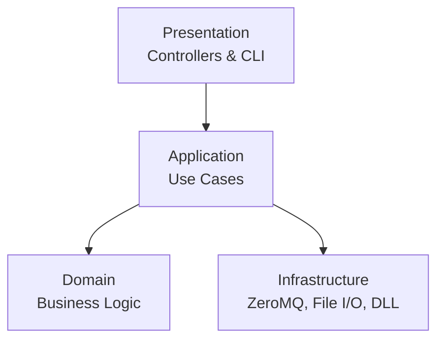

# 🧱 Clean Architecture Implementation

> *How Clean Architecture principles are applied in the Auto Futures Trading Machine*

## 🏗️ Layered Structure

1. **Presentation Layer** (`src/app/cli_pfcf/controllers`, `CLIApplication`)
   - Handles user input/output
   - Delegates to application use cases

2. **Application Layer** (`src/app/bootstrap`, `src/app/use_cases`)
   - Orchestrates workflows (e.g., `RunGatewayUseCase`)
   - Validates inputs and constructs results

3. **Domain Layer** (`src/domain` or embedded in use cases)
   - Core business rules (e.g., `SupportResistanceStrategy`)
   - DTOs and enums (`TickEvent`, `TradingSignal`)

4. **Infrastructure Layer** (`src/infrastructure`)
   - External systems: ZeroMQ, DLL Gateway, file repositories
   - Implements abstractions defined by application layer

## 🚀 Benefits

- **Testability**: Business logic is independent of messaging or file systems
- **Maintainability**: Changes in one layer don't ripple into others
- **Flexibility**: Swap infrastructure implementations (e.g., ZeroMQ → Kafka)

## 🔄 Data Flow Example

1. User selects **Start All Components** → `AllInOneController`
2. Controller calls **SystemManager** (`APP` layer)
3. `SystemManager` uses **ZmqPublisher** (`INF` layer) to broadcast ticks
4. **Strategy Process** (`APP` + `DOM` layers) receives ticks, evaluates rules
5. `TradingSignal` flows back via **ZmqPusher** (`INF` layer) to executor

---

*Adhering to Clean Architecture ensures our system remains robust as it grows.* 