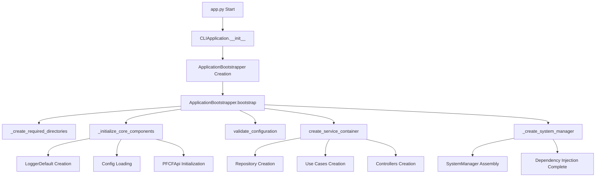
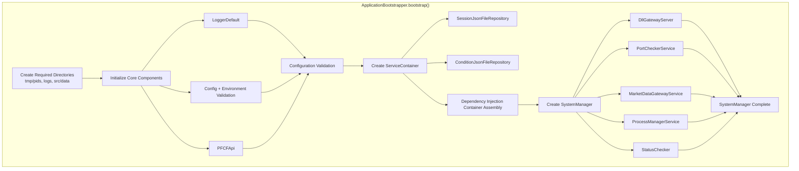
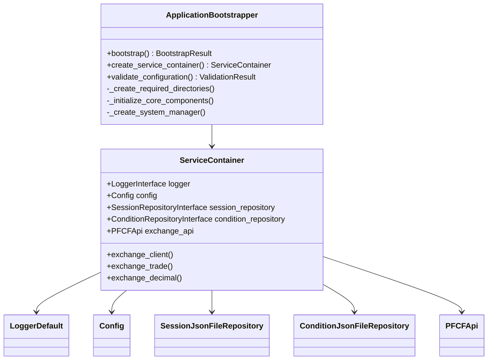
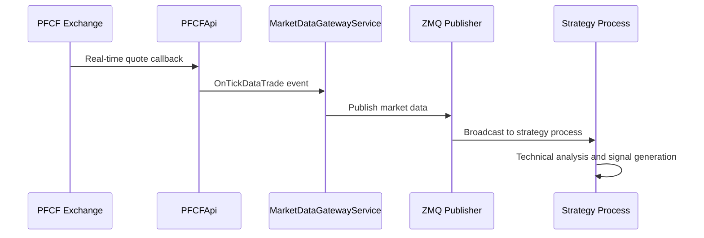
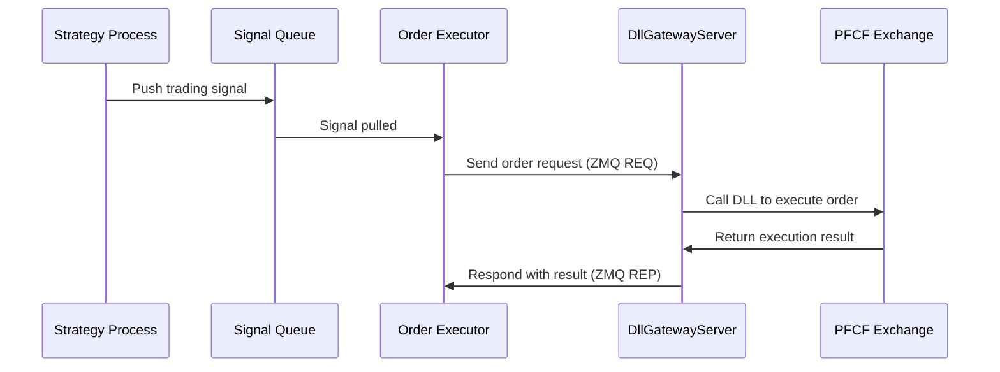
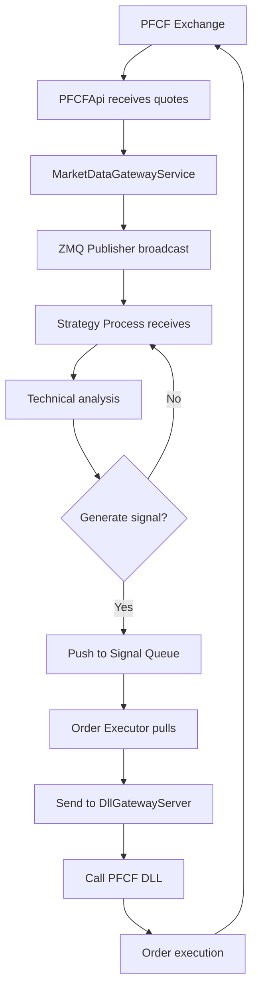
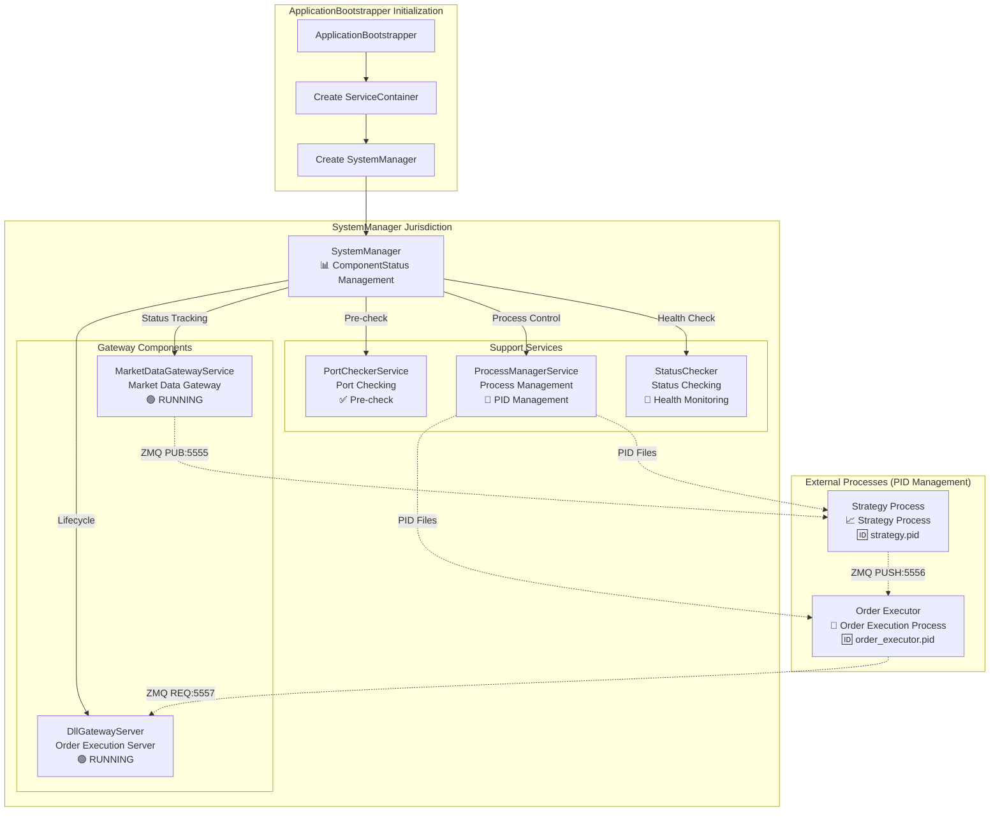
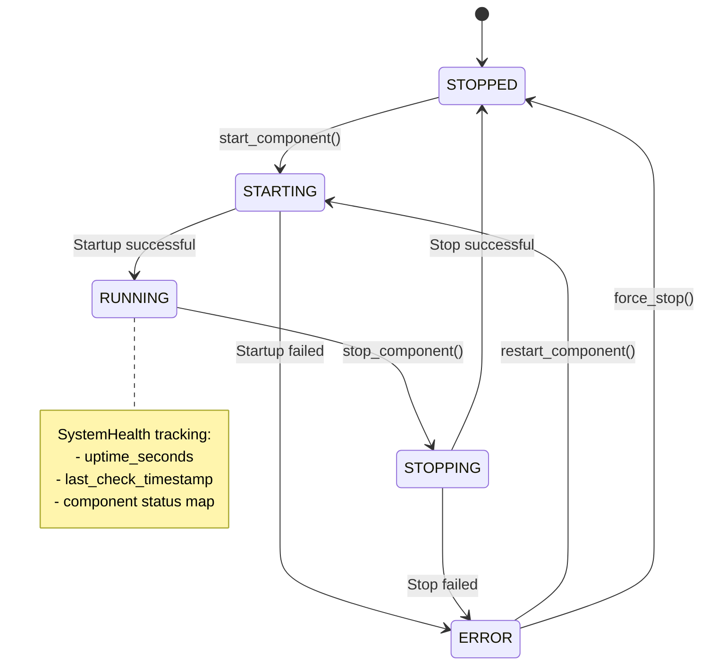
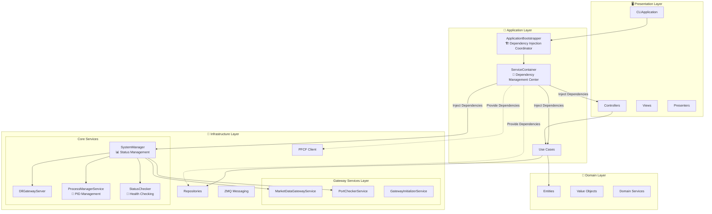

# 🏗️ Auto Futures Trading Machine - Architecture Guide

## 📋 Table of Contents
1. [System Overview](#system-overview)
2. [Application Startup Flow](#application-startup-flow)
3. [Class Responsibilities](#class-responsibilities)
4. [Data Flow Diagrams](#data-flow-diagrams)
5. [Component Interaction](#component-interaction)
6. [OOP Design Principles](#oop-design-principles)

---

## System Overview

This is a multi-process automated futures trading system that uses Clean Architecture design principles. The system consists of three main processes:

```
┌─────────────────────────────────────────────────────────┐
│                    🖥️  Main Process                     │
│                      (app.py)                          │
│  ┌─────────────────┐  ┌─────────────────┐              │
│  │ CLIApplication  │  │ SystemManager   │              │
│  │                 │  │                 │              │
│  │ ├─ User Interface│  │ ├─ Lifecycle Mgmt│              │
│  │ ├─ Menu System   │  │ ├─ Component Coord│              │
│  │ └─ Command Proc  │  │ └─ Status Monitor│              │
│  └─────────────────┘  └─────────────────┘              │
│           │                      │                     │
│           │              ┌─────────────────┐            │
│           └──────────────│ MarketDataGateway │          │
│                          │ + DllGatewayServer │         │
│                          └─────────────────┘            │
└─────────────────────────────────────────────────────────┘
                              │
                              │ ZMQ Communication
                              │
         ┌────────────────────┼────────────────────┐
         │                   │                    │
         ▼                   ▼                    ▼
┌─────────────────┐ ┌─────────────────┐ ┌─────────────────┐
│  📊 Strategy    │ │  📈 Market Data │ │  💼 Order       │
│    Process      │ │    Flow         │ │   Executor      │
│                 │ │                 │ │   Process       │
│ ├─ Technical Analysis │ ├─ Real-time Quotes │ ├─ Order Execution │
│ ├─ Signal Generation  │ ├─ Price Broadcast  │ ├─ Risk Control    │
│ └─ Strategy Logic     │ └─ Data Distribution│ └─ Execution Confirm│
└─────────────────┘ └─────────────────┘ └─────────────────┘
```

---

## Application Startup Flow

### 1️⃣ **Application Initialization Phase**



### 2️⃣ **System Manager Assembly Process**



### 3️⃣ **ServiceContainer Dependency Injection Architecture**



---

## Class Responsibilities

### 🎯 **Main Classes and Responsibilities**

#### **Application Layer**

```
CLIApplication
├── 🎮 Responsibility: Application lifecycle management
├── 📝 Functions: 
│   ├─ Start and shutdown application
│   ├─ Exception handling and graceful exit
│   └─ User interface coordination
└── 🔗 Dependencies: ApplicationBootstrapper, SystemManager
```

```
ApplicationBootstrapper  
├── 🏗️ Responsibility: Dependency injection and initialization
├── 📝 Functions:
│   ├─ Create all service instances
│   ├─ Configuration validation
│   ├─ Service container assembly
│   └─ SystemManager construction
└── 🔗 Dependencies: Config, Logger, PFCFApi
```

#### **Infrastructure Layer**

```
ApplicationBootstrapper
├── 🏗️ Responsibility: Application initialization and dependency injection
├── 📝 Functions:
│   ├─ Create required directories (tmp/pids, logs, data)
│   ├─ Initialize core components (Logger, Config, PFCFApi)
│   ├─ Configuration validation (env vars, DLL Gateway settings)
│   ├─ ServiceContainer assembly
│   └─ SystemManager construction
└── 🔗 Manages: Entire application startup process
```

```
ServiceContainer
├── 🎯 Responsibility: Centralized dependency management
├── 📝 Functions:
│   ├─ Dependency injection container
│   ├─ Service instance management
│   ├─ Unified interface access
│   └─ Exchange API proxy
└── 🔗 Manages:
    ├─ LoggerInterface
    ├─ Config
    ├─ SessionRepository
    ├─ ConditionRepository
    └─ PFCFApi (exchange_client, exchange_trade, exchange_decimal)
```

```
SystemManager
├── 🎛️ Responsibility: System component lifecycle management
├── 📝 Functions:
│   ├─ Start/stop trading system
│   ├─ Component status monitoring (ComponentStatus enum)
│   ├─ Health checks (SystemHealth)
│   ├─ System restart and error recovery
│   └─ Runtime tracking
└── 🔗 Manages:
    ├─ MarketDataGatewayService
    ├─ DllGatewayServer  
    ├─ ProcessManagerService
    ├─ PortCheckerService
    └─ StatusChecker
```

##### **Gateway Services Layer**

```
MarketDataGatewayService
├── 📊 Responsibility: Market data infrastructure management
├── 📝 Functions:
│   ├─ ZMQ Publisher initialization and lifecycle
│   ├─ PFCF API callback connection
│   ├─ Real-time quote broadcasting (port 5555)
│   ├─ Data flow management and error handling
│   └─ Gateway status monitoring
└── 🔗 Dependencies: Config, Logger, PFCFApi
```

```
PortCheckerService
├── 🔍 Responsibility: Network port availability validation
├── 📝 Functions:
│   ├─ ZMQ port checking (5555, 5556, 5557)
│   ├─ Port conflict detection
│   ├─ Network resource validation
│   └─ Pre-startup checks
└── 🔗 Dependencies: Config, Logger
```

```
ProcessManagerService
├── ⚙️ Responsibility: Child process lifecycle management
├── 📝 Functions:
│   ├─ PID file management (tmp/pids/)
│   ├─ Process startup and shutdown
│   ├─ Path resolution and validation
│   ├─ Graceful shutdown mechanism
│   └─ Process status tracking
└── 🔗 Dependencies: Config, Logger
```

```
MarketDataGatewayService
├── 📊 Responsibility: Market data publishing
├── 📝 Functions:
│   ├─ ZMQ Publisher initialization
│   ├─ PFCF API callback connection
│   ├─ Real-time quote broadcasting
│   └─ Data flow management
└── 🔗 Dependencies: ZmqPublisher, TickProducer, PFCFApi
```

```
DllGatewayServer
├── 💼 Responsibility: Order execution server
├── 📝 Functions:
│   ├─ ZMQ REQ/REP server
│   ├─ Order request processing
│   ├─ PFCF DLL invocation
│   └─ Execution result response
└── 🔗 Dependencies: PFCFApi, ZMQ REP Socket
```

#### **Business Logic Layer (Interactor Layer)**

```
Use Cases (Various business use cases)
├── 🎯 Responsibility: Business logic encapsulation
├── 📝 Functions:
│   ├─ Business rule execution
│   ├─ Data validation
│   ├─ Error handling
│   └─ Result return
└── 🔗 Dependencies: Entities, Repositories, Services
```

---

## Data Flow Diagrams

### 📈 **Market Data Flow**



### 💰 **Order Execution Flow**



### 🔄 **Complete Trading Cycle**



---

## Component Interaction

### 🎛️ **SystemManager Management Scope and Status Management**



### 🔄 **Component Status Management**



### 🏛️ **Clean Architecture Layers with ServiceContainer Integration**



---

## OOP Design Principles

### 🎯 **SOLID Principles Application**

#### **S - Single Responsibility Principle**
- ✅ `MarketDataGatewayService`: Only responsible for market data publishing
- ✅ `DllGatewayServer`: Only responsible for order execution
- ✅ `SystemManager`: Only responsible for component lifecycle management

#### **O - Open/Closed Principle**
- ✅ Uses interfaces to define contracts (`MarketDataGatewayServiceInterface`)
- ✅ Can extend new trading strategies without modifying existing code

#### **L - Liskov Substitution Principle**
- ✅ All services implement corresponding interfaces
- ✅ Can easily substitute different implementations

#### **I - Interface Segregation Principle**
- ✅ Separates interfaces for different responsibilities
- ✅ Clients only depend on interfaces they need

#### **D - Dependency Inversion Principle**
- ✅ High-level modules (Use Cases) don't depend on low-level modules (Infrastructure)
- ✅ Both depend on abstractions (Interfaces)

### 🔄 **Design Patterns Application**

#### **Repository Pattern**
```python
# Abstract
SessionRepositoryInterface
# Implementation
SessionInMemoryRepository
SessionJsonFileRepository
```

#### **Dependency Injection Pattern**
```python
# ApplicationBootstrapper assembles all dependencies
system_manager = SystemManager(
    logger=logger,
    market_data_gateway=market_data_gateway,
    dll_gateway_server=dll_gateway_server,
    # ...other dependencies
)
```

#### **Observer Pattern**
```python
# PFCF API callback mechanism
exchange_client.DQuoteLib.OnTickDataTrade += tick_producer.handle_tick_data
```

#### **Command Pattern**
```python
# Use Cases encapsulate business operations
class SendMarketOrderUseCase:
    def execute(self, input_dto: SendMarketOrderInputDto) -> SendMarketOrderOutputDto
```

#### **Service Container Pattern**
```python
# ServiceContainer centrally manages all dependencies
class ServiceContainer:
    def __init__(self, logger, config, session_repository, condition_repository, exchange_api):
        self.logger = logger
        self.config = config
        # ... other dependency injection
```

#### **Bootstrap Pattern**
```python
# ApplicationBootstrapper coordinates initialization flow
class ApplicationBootstrapper:
    def bootstrap(self) -> BootstrapResult:
        # 1. Create directories
        # 2. Initialize core components
        # 3. Configuration validation
        # 4. Create service container
        # 5. Assemble system manager
```

#### **State Management Pattern**
```python
# ComponentStatus enum manages component states
class ComponentStatus(Enum):
    STOPPED = "stopped"
    STARTING = "starting"
    RUNNING = "running"
    STOPPING = "stopping"
    ERROR = "error"
```

---

## 🎯 **Summary**

This architecture's core advantages:

1. **🔧 Modular Design**: Each class has clear responsibilities
2. **🔄 Testability**: Dependency injection makes unit testing easy
3. **📈 Extensibility**: Following SOLID principles makes adding new features easy
4. **🛡️ Maintainability**: Clean Architecture keeps code structure clear
5. **⚡ High Performance**: Multi-process design bypasses Python GIL limitations

Through this documentation, developers can:
- Quickly understand the overall system architecture
- Find specific classes that need modification
- Understand how data flows through the system
- Master component interaction relationships

---

*For more detailed information, see:*
- [ServiceContainer Architecture Update](./SERVICECONTAINER_ARCHITECTURE_UPDATE.md)
- [Class Design Guide](./CLASS_DESIGN_GUIDE.md)
- [Detailed Flow Diagrams](./DETAILED_FLOW_DIAGRAMS.md)