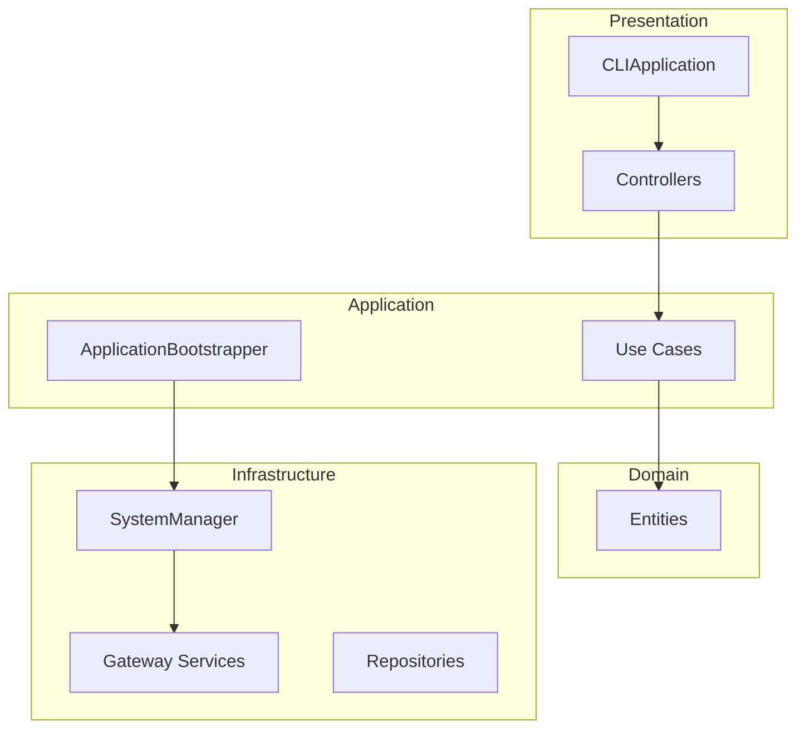

# 🏛️ 類別設計指南

## 📋 核心類別職責

| 類別 | 層次 | 職責 | 依賴 |
|------|------|------|------|
| `CLIApplication` | Presentation | 用戶界面協調 | SystemManager |
| `ApplicationBootstrapper` | Application | 依賴注入管理 | Config, Logger |
| `SystemManager` | Infrastructure | 系統生命週期管理 | Gateway服務 |
| `MarketDataGatewayService` | Infrastructure | 市場數據發佈 | ZMQ, TickProducer |
| `DllGatewayServer` | Infrastructure | 訂單執行服務 | ZMQ REP |
| `Use Cases` | Interactor | 業務邏輯 | Entities, Repositories |
| `Controllers` | Presentation | 用戶輸入處理 | Use Cases |

## 📊 Clean Architecture 層次



### 🎯 層次職責

#### Presentation Layer
- **CLIApplication**: 應用生命週期管理
- **Controllers**: 用戶輸入處理，調用 Use Cases

#### Application Layer  
- **ApplicationBootstrapper**: 依賴注入配置
- **Use Cases**: 業務邏輯協調

#### Domain Layer
- **Entities**: 業務實體 (User, TradingSignal)
- **Value Objects**: 不可變值類型

#### Infrastructure Layer
- **SystemManager**: 系統組件生命週期管理
- **Gateway Services**: 外部系統集成 (PFCF, ZMQ)
- **Repositories**: 數據持久化

## 🔧 依賴注入流程

### ApplicationBootstrapper 組裝順序

1. **核心組件**: Config, Logger, PFCFApi
2. **服務容器**: Repositories → Use Cases → Controllers  
3. **系統管理器**: Gateway Services → SystemManager

### 依賴注入原則

✅ **正確做法**:
```python
class UseCase:
    def __init__(self, repository: RepositoryInterface):
        self._repository = repository  # 依賴抽象
```

❌ **錯誤做法**:
```python
class UseCase:
    def __init__(self):
        self._repository = ConcreteRepository()  # 依賴具體實現
```

## 🎛️ 核心類別

### SystemManager
**職責**: 系統組件生命週期協調
- `start_trading_system()`: 按順序啟動 Gateway → Strategy → Order Executor
- `_start_gateway()`: 端口檢查 → 市場數據初始化 → 回調連接 → 服務器啟動

### MarketDataGatewayService
**職責**: 市場數據處理
- `initialize_market_data_publisher()`: 創建 ZMQ Publisher (5555) + TickProducer
- `connect_exchange_callbacks()`: 連接 PFCF OnTickDataTrade 回調

### DllGatewayServer  
**職責**: 訂單執行服務
- `start()`: 啟動 ZMQ REP 服務器 (5557)
- `_process_request()`: 處理 send_order, get_positions, health_check

## 🎨 設計模式

### Factory Pattern
**ApplicationBootstrapper**: 集中創建和組裝所有服務實例

### Repository Pattern  
**抽象數據訪問**: SessionRepositoryInterface → InMemory/JsonFile 實現

### Observer Pattern
**PFCF 回調**: exchange_client.OnTickDataTrade += tick_producer.handle_tick_data

### Command Pattern
**Use Cases**: 封裝完整業務操作，支持記錄和審計

### Adapter Pattern
**DTO 轉換**: 內部格式 ↔ PFCF DLL 格式

## 🔧 擴展指南

### 添加新功能步驟

1. **Domain Layer**: 創建 Entity/Value Object
2. **Interactor Layer**: 實現 Use Case
3. **Infrastructure Layer**: 添加技術實現
4. **Application Layer**: 在 Bootstrapper 中註冊

### SOLID 原則檢查

- **S**ingle Responsibility: 類別只有一個變更理由
- **O**pen/Closed: 透過擴展而非修改添加功能
- **L**iskov Substitution: 子類型可以替換基類型
- **I**nterface Segregation: 客戶端只依賴需要的介面
- **D**ependency Inversion: 依賴抽象而非具體實現

---

**架構優勢**: 模組化、可測試、可擴展、可維護的 Clean Architecture 實現