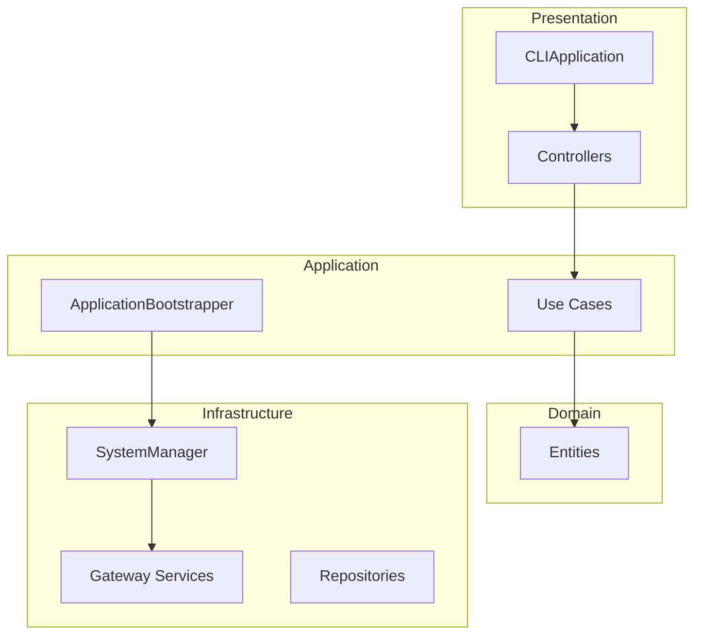

# 🏛️ Class Design Guide

## 📋 Core Class Responsibilities

| Class | Layer | Responsibility | Dependencies |
|-------|-------|----------------|--------------|
| `CLIApplication` | Presentation | User interface coordination | SystemManager |
| `ApplicationBootstrapper` | Application | Dependency injection management | Config, Logger |
| `SystemManager` | Infrastructure | System lifecycle management | Gateway services |
| `MarketDataGatewayService` | Infrastructure | Market data publishing | ZMQ, TickProducer |
| `DllGatewayServer` | Infrastructure | Order execution service | ZMQ REP |
| `Use Cases` | Interactor | Business logic | Entities, Repositories |
| `Controllers` | Presentation | User input handling | Use Cases |

## 📊 Clean Architecture Layers



### 🎯 Layer Responsibilities

#### Presentation Layer
- **CLIApplication**: Application lifecycle management
- **Controllers**: User input processing, calling Use Cases

#### Application Layer  
- **ApplicationBootstrapper**: Dependency injection configuration
- **Use Cases**: Business logic coordination

#### Domain Layer
- **Entities**: Business entities (User, TradingSignal)
- **Value Objects**: Immutable value types

#### Infrastructure Layer
- **SystemManager**: System component lifecycle management
- **Gateway Services**: External system integration (PFCF, ZMQ)
- **Repositories**: Data persistence

## 🔧 Dependency Injection Flow

### ApplicationBootstrapper Assembly Order

1. **Core Components**: Config, Logger, PFCFApi
2. **Service Container**: Repositories → Use Cases → Controllers  
3. **System Manager**: Gateway Services → SystemManager

### Dependency Injection Principles

✅ **Correct Approach**:
```python
class UseCase:
    def __init__(self, repository: RepositoryInterface):
        self._repository = repository  # Depend on abstraction
```

❌ **Wrong Approach**:
```python
class UseCase:
    def __init__(self):
        self._repository = ConcreteRepository()  # Depend on concrete implementation
```

## 🎛️ Core Classes

### SystemManager
**Responsibility**: System component lifecycle coordination
- `start_trading_system()`: Start components in order: Gateway → Strategy → Order Executor
- `_start_gateway()`: Port check → Market data initialization → Callback connection → Server startup

### MarketDataGatewayService
**Responsibility**: Market data processing
- `initialize_market_data_publisher()`: Create ZMQ Publisher (5555) + TickProducer
- `connect_exchange_callbacks()`: Connect PFCF OnTickDataTrade callbacks

### DllGatewayServer  
**Responsibility**: Order execution service
- `start()`: Start ZMQ REP server (5557)
- `_process_request()`: Handle send_order, get_positions, health_check

## 🎨 Design Patterns

### Factory Pattern
**ApplicationBootstrapper**: Centralized creation and assembly of all service instances

### Repository Pattern  
**Abstract data access**: SessionRepositoryInterface → InMemory/JsonFile implementations

### Observer Pattern
**PFCF callbacks**: exchange_client.OnTickDataTrade += tick_producer.handle_tick_data

### Command Pattern
**Use Cases**: Encapsulate complete business operations, support logging and auditing

### Adapter Pattern
**DTO conversion**: Internal format ↔ PFCF DLL format

## 🔧 Extension Guide

### Steps to Add New Features

1. **Domain Layer**: Create Entity/Value Object
2. **Interactor Layer**: Implement Use Case
3. **Infrastructure Layer**: Add technical implementation
4. **Application Layer**: Register in Bootstrapper

### SOLID Principles Checklist

- **S**ingle Responsibility: Classes have only one reason to change
- **O**pen/Closed: Add functionality through extension, not modification
- **L**iskov Substitution: Subtypes can replace base types
- **I**nterface Segregation: Clients depend only on interfaces they need
- **D**ependency Inversion: Depend on abstractions, not concrete implementations

## ⚠️ Architecture Limitations & Extensibility

### Broker API Coupling Level

This system is currently **highly coupled to Taiwan Unified Futures (PFCF) DLL**, with main coupling points including:

| Layer | Coupling Level | Impact |
|-------|----------------|--------|
| Infrastructure | 🔴 Extremely High | Direct PFCF API calls |
| Interactor | 🟡 Medium | DTOs contain PFCF-specific fields |
| Domain | 🟢 Low | Entity layer relatively independent |

### Migrating to Other Brokers

If you need to support other brokers (such as Yuanta Securities, Capital Futures), we recommend:

1. **Create ExchangeApiInterface abstraction layer**
2. **Refactor DTOs to use broker-neutral format**  
3. **Implement broker-specific adapter patterns**

> 📖 **Detailed Migration Guide**: [DLL Porting Guide](DLL_PORTING_GUIDE.md) - Complete migration steps and architecture refactoring suggestions

---

**Architecture Advantages**: Modular, testable, extensible, maintainable Clean Architecture implementation  
**Architecture Limitations**: Highly dependent on Taiwan Unified Futures API, migrating to other brokers requires major refactoring