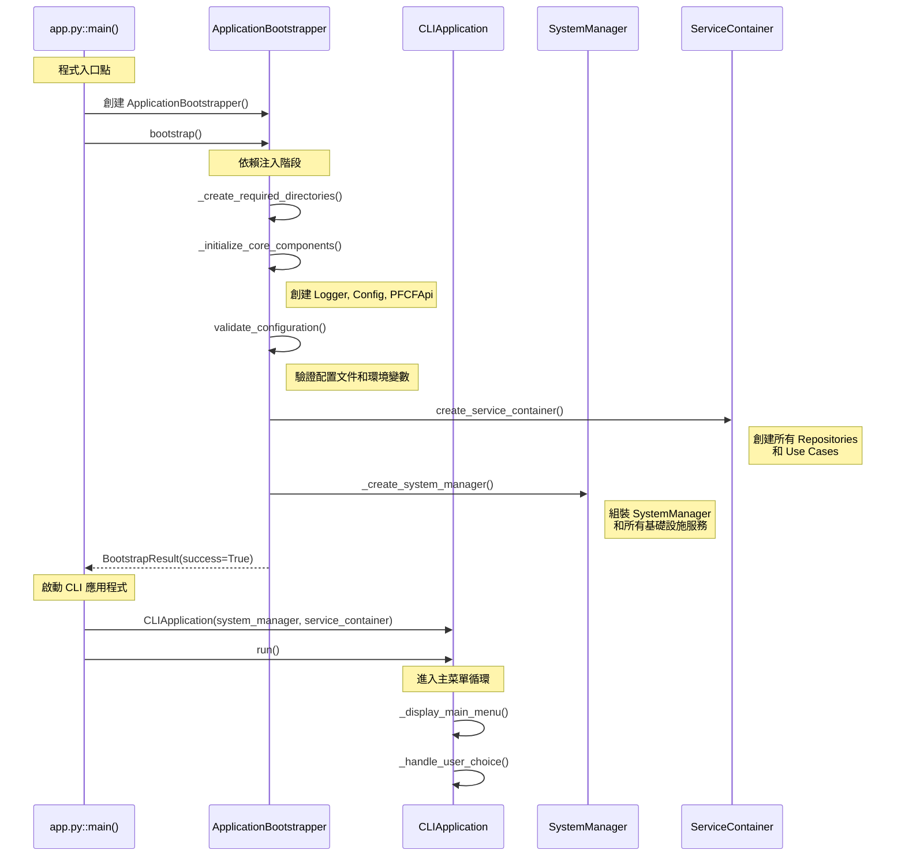
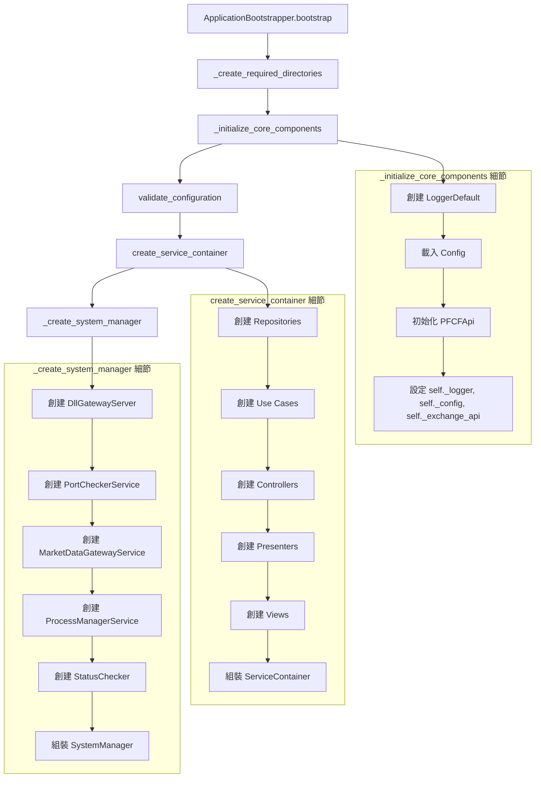
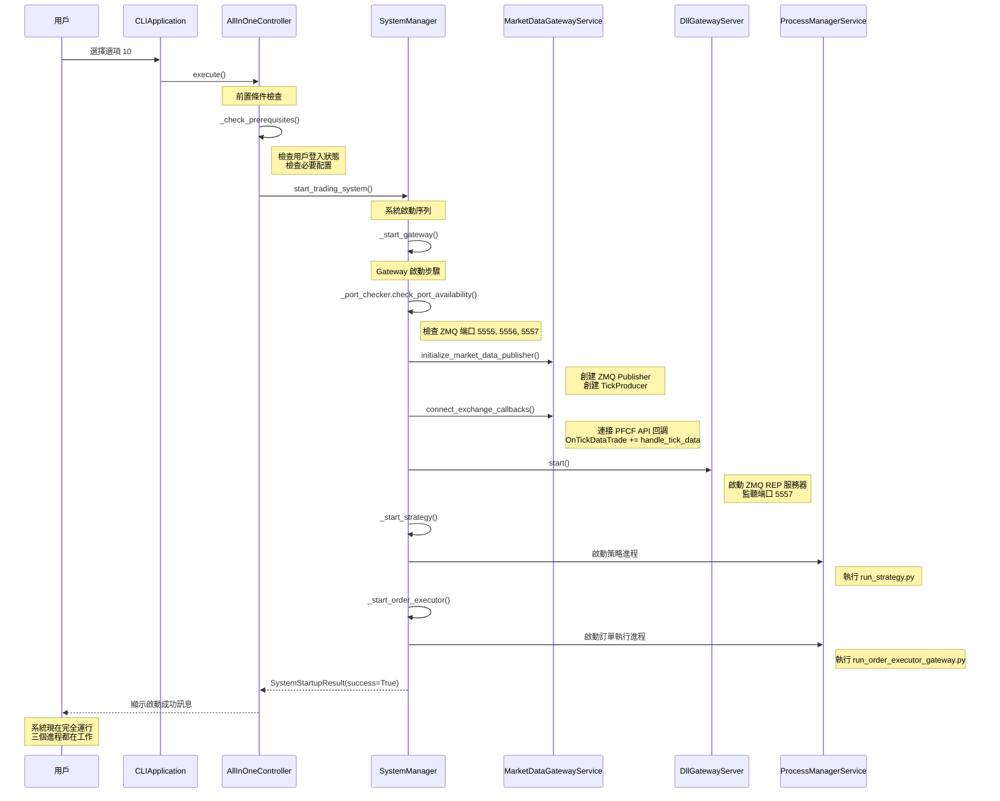
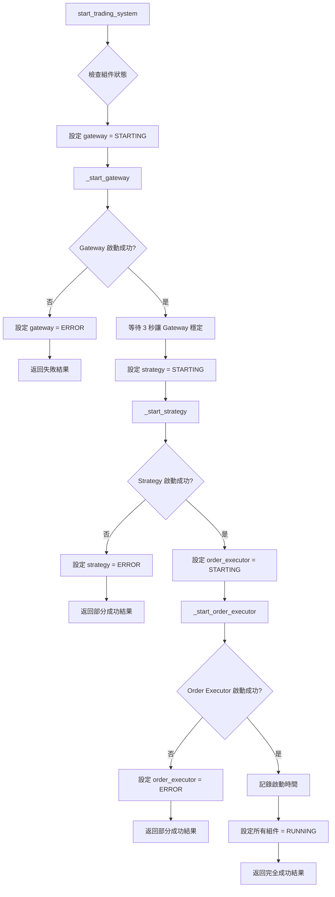
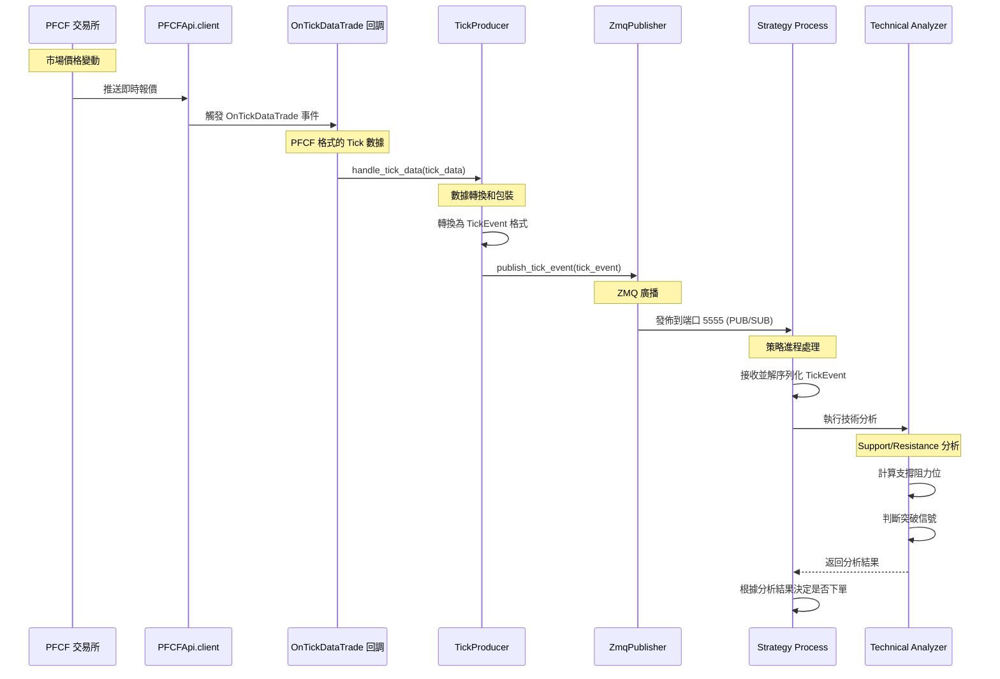
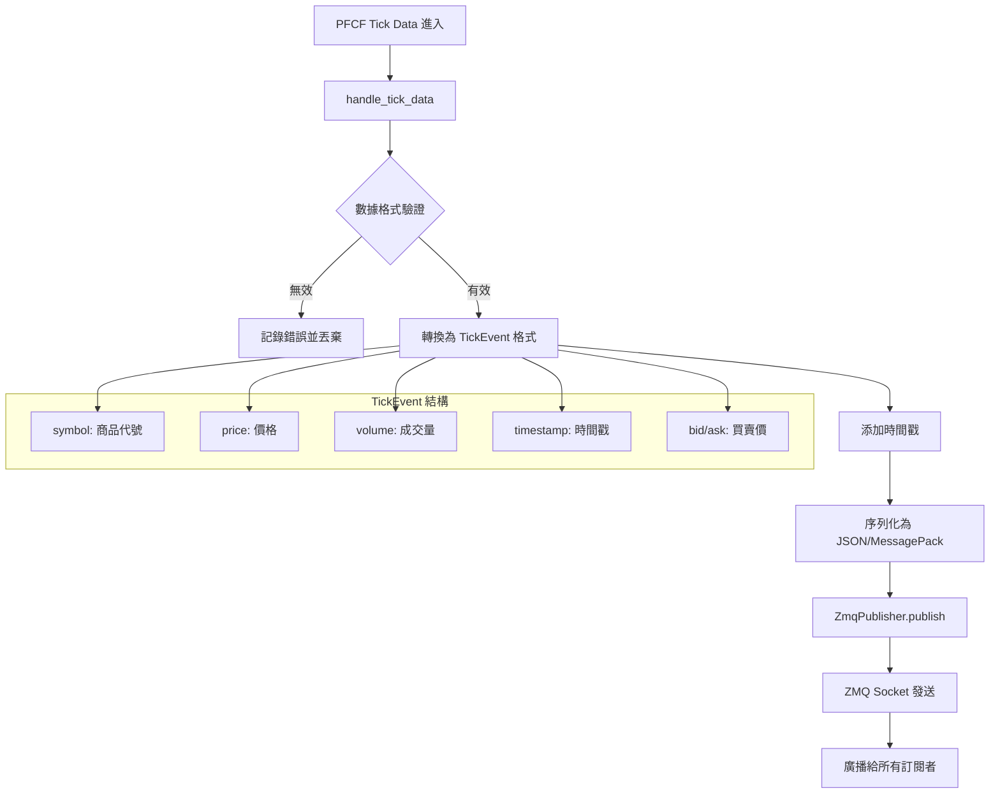
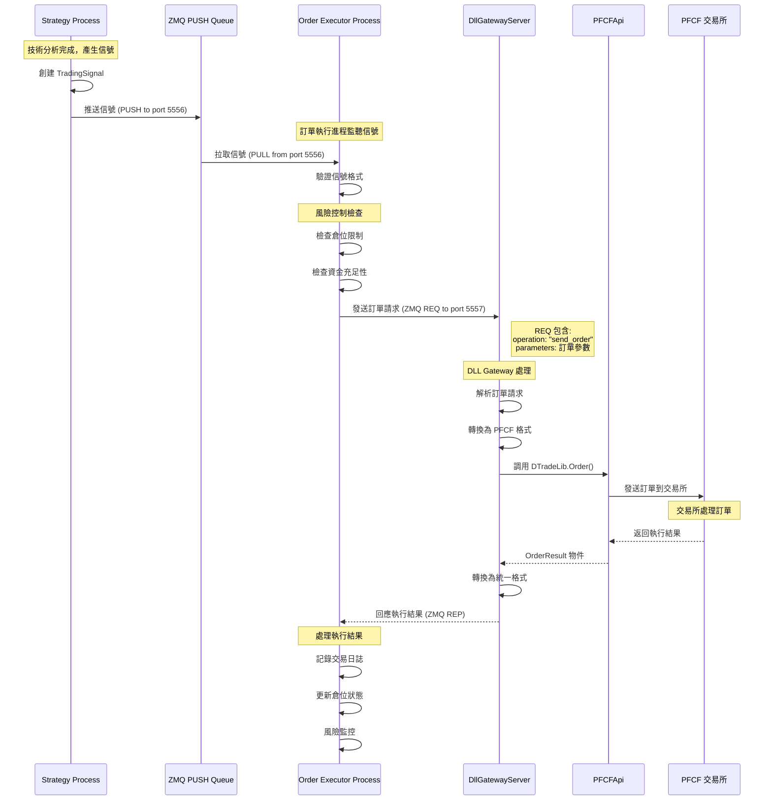
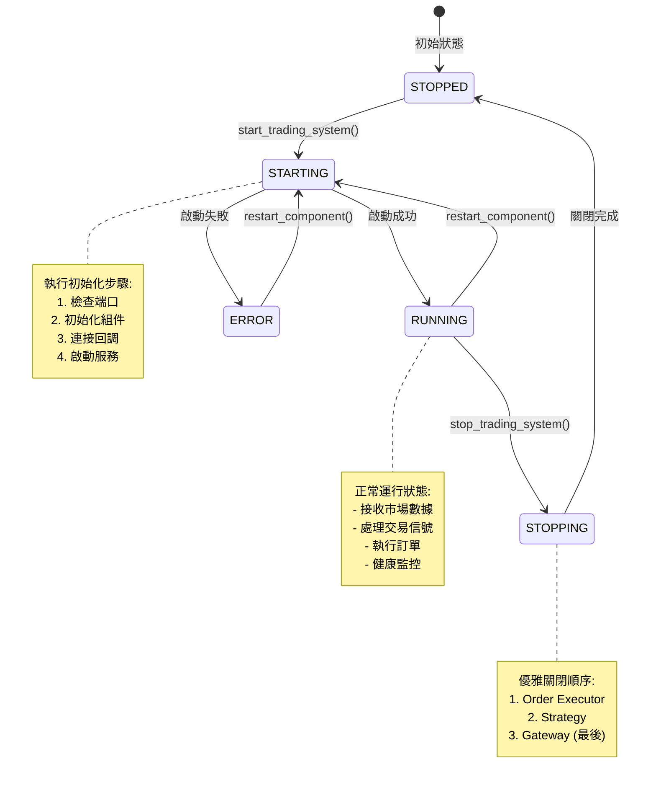
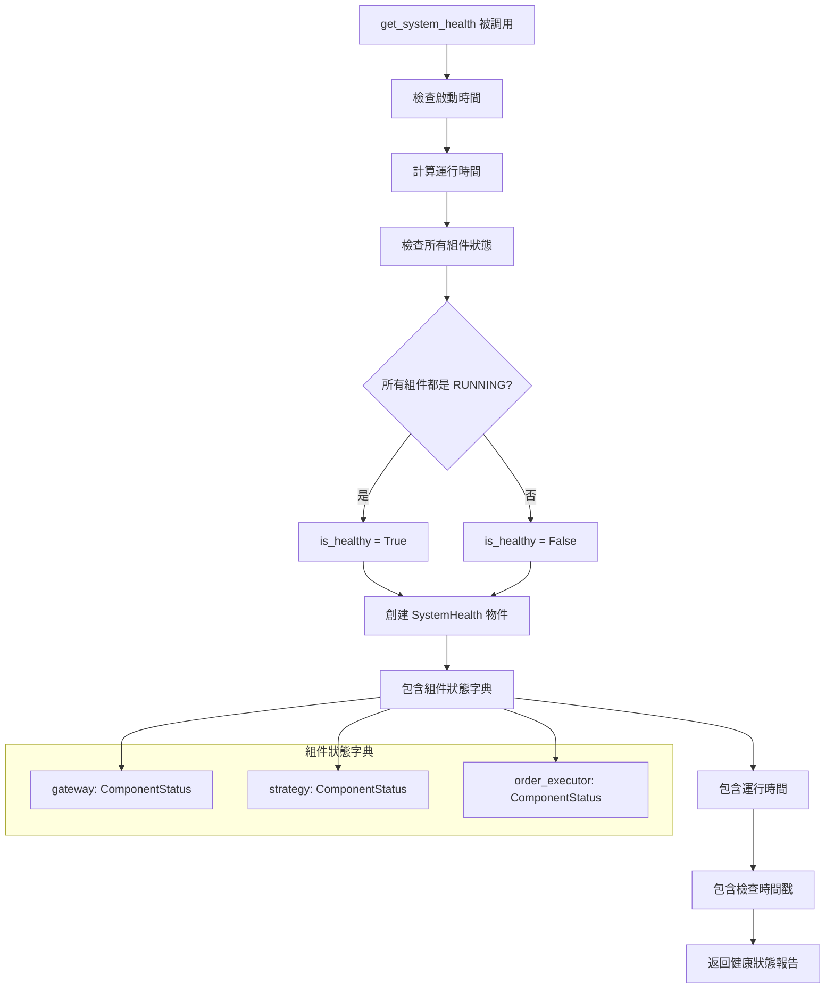
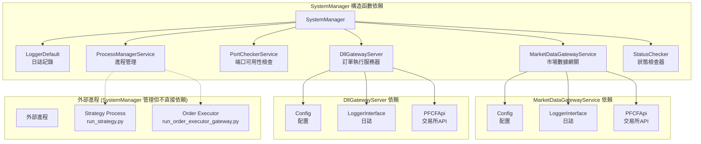

# 🔄 Auto Futures Trading Machine - 詳細流程圖

## 📋 目錄
1. [應用程式啟動詳細流程](#應用程式啟動詳細流程)
2. [All-In-One 初始化流程](#all-in-one-初始化流程)
3. [市場數據處理流程](#市場數據處理流程)
4. [訂單執行完整流程](#訂單執行完整流程)
5. [SystemManager 狀態管理](#systemmanager-狀態管理)

---

## 應用程式啟動詳細流程

### 🚀 **從 app.py 到運行的完整路徑**



### 🏗️ **ApplicationBootstrapper 內部詳細流程**



---

## All-In-One 初始化流程

### 🎯 **當用戶選擇選項 10 (All-In-One) 時**



### 🔧 **SystemManager.start_trading_system() 內部邏輯**



---

## 市場數據處理流程

### 📊 **從 PFCF 交易所到策略進程的數據流**



### 📈 **TickProducer 內部處理機制**



---

## 訂單執行完整流程

### 💰 **從策略信號到訂單執行的完整路徑**



### 🎯 **TradingSignal 和 OrderRequest 轉換過程**

```mermaid
graph TD
    A[Strategy 產生 TradingSignal] --> B[包含策略決策信息]
    B --> C[symbol, direction, confidence, timestamp]
    
    C --> D[OrderExecutor 接收]
    D --> E[轉換為 OrderRequest]
    
    E --> F[添加交易參數]
    F --> G[order_account, price, quantity]
    F --> H[order_type, time_in_force]
    F --> I[open_close, day_trade]
    
    G --> J[發送給 DllGatewayServer]
    H --> J
    I --> J
    
    J --> K[轉換為 PFCF 格式]
    K --> L[調用 exchange_client.Order()]
    
    subgraph "PFCF DLL 格式"
        M[OrderObject]
        N[ACTNO: 帳號]
        O[PRODUCTID: 商品]
        P[BS: 買賣別]
        Q[PRICE: 價格]
        R[ORDERQTY: 數量]
    end
    
    K --> M
    M --> N
    M --> O
    M --> P
    M --> Q
    M --> R
```

---

## SystemManager 狀態管理

### 🎛️ **組件狀態轉換圖**



### 🔄 **SystemManager.get_system_health() 檢查流程**



### 📊 **SystemManager 依賴關係圖**



---

## 🎯 **關鍵洞察**

### 💡 **設計亮點**

1. **分離關注點**: MarketDataGatewayService 和 DllGatewayServer 各司其職
2. **狀態管理**: SystemManager 統一管理所有組件的生命週期
3. **錯誤處理**: 組件啟動失敗時，系統可以部分運行或優雅降級
4. **可觀測性**: 詳細的狀態追蹤和健康檢查機制

### ⚠️ **潛在改進點**

1. **硬編碼延遲**: `time.sleep(3)` 等待 Gateway 初始化缺乏靈活性
2. **錯誤恢復**: 組件失敗後的自動重試機制
3. **監控增強**: 更詳細的性能指標和監控數據
4. **配置熱重載**: 運行時修改配置的能力

這些流程圖幫助開發者：
- 🎯 **精確定位問題**: 知道在哪個步驟可能出錯
- 🔧 **指導開發**: 了解添加新功能時的插入點
- 📊 **性能優化**: 識別瓶頸和優化機會
- 🛡️ **故障排除**: 快速診斷系統問題