# 🔄 Auto Futures Trading Machine - Detailed Flow Diagrams

## 📋 Table of Contents
1. [Application Startup Detailed Flow](#application-startup-detailed-flow)
2. [All-In-One Initialization Flow](#all-in-one-initialization-flow)
3. [Market Data Processing Flow](#market-data-processing-flow)
4. [Order Execution Complete Flow](#order-execution-complete-flow)
5. [SystemManager State Management](#systemmanager-state-management)

---

## Application Startup Detailed Flow

### 🚀 **Complete Path from app.py to Running**

### 🏗️ **ApplicationBootstrapper Internal Detailed Flow**

---

## All-In-One Initialization Flow

### 🎯 **When User Selects Option 10 (All-In-One)**

```mermaid
sequenceDiagram
    participant User as User
    participant CLI as CLIApplication
    participant Controller as AllInOneController
    participant SM as SystemManager
    participant MDG as MarketDataGatewayService
    participant DGS as DllGatewayServer
    participant PM as ProcessManagerService
    
    User->>CLI: Select option 10
    CLI->>Controller: execute()
    
    Note over Controller: Prerequisites check
    Controller->>Controller: _check_prerequisites()
    Note right of Controller: Check user login status<br/>Check necessary configuration
    
    Controller->>SM: start_trading_system()
    
    Note over SM: System startup sequence
    SM->>SM: _start_gateway()
    
    Note over SM: Gateway startup steps
    SM->>SM: _port_checker.check_port_availability()
    Note right of SM: Check ZMQ ports 5555, 5556, 5557
    
    SM->>MDG: initialize_market_data_publisher()
    Note right of MDG: Create ZMQ Publisher<br/>Create TickProducer
    
    SM->>MDG: connect_exchange_callbacks()
    Note right of MDG: Connect PFCF API callbacks<br/>OnTickDataTrade += handle_tick_data
    
    SM->>DGS: start()
    Note right of DGS: Start ZMQ REP server<br/>Listen on port 5557
    
    SM->>SM: _start_strategy()
    SM->>PM: Start strategy process
    Note right of PM: Execute run_strategy.py
    
    SM->>SM: _start_order_executor()
    SM->>PM: Start order executor process
    Note right of PM: Execute run_order_executor_gateway.py
    
    SM-->>Controller: SystemStartupResult(success=True)
    Controller-->>User: Display startup success message
    
    Note over User: System now fully running<br/>All three processes working
```

### 🔧 **SystemManager.start_trading_system() Internal Logic**

---

## Market Data Processing Flow

### 📊 **Data Flow from PFCF Exchange to Strategy Process**

### 📈 **TickProducer Internal Processing Mechanism**

---

## Order Execution Complete Flow

### 💰 **Complete Path from Strategy Signal to Order Execution**

### 🎯 **TradingSignal to OrderRequest Conversion Process**

---

## SystemManager State Management

### 🎛️ **Component State Transition Diagram**

### 🔄 **SystemManager.get_system_health() Check Flow**

### 📊 **SystemManager Dependency Diagram**

---

## 🎯 **Key Insights**

### 💡 **Design Highlights**

1. **Separation of Concerns**: MarketDataGatewayService and DllGatewayServer each have their own responsibilities
2. **State Management**: SystemManager uniformly manages lifecycle of all components
3. **Error Handling**: System can run partially or degrade gracefully when component startup fails
4. **Observability**: Detailed state tracking and health check mechanisms

### ⚠️ **Potential Improvements**

1. **Hardcoded Delays**: `time.sleep(3)` waiting for Gateway initialization lacks flexibility
2. **Error Recovery**: Automatic retry mechanism after component failure
3. **Enhanced Monitoring**: More detailed performance metrics and monitoring data
4. **Configuration Hot Reload**: Ability to modify configuration at runtime

These flow diagrams help developers:
- 🎯 **Pinpoint Issues**: Know where errors might occur at each step
- 🔧 **Guide Development**: Understand insertion points when adding new features
- 📊 **Performance Optimization**: Identify bottlenecks and optimization opportunities
- 🛡️ **Troubleshooting**: Quickly diagnose system problems