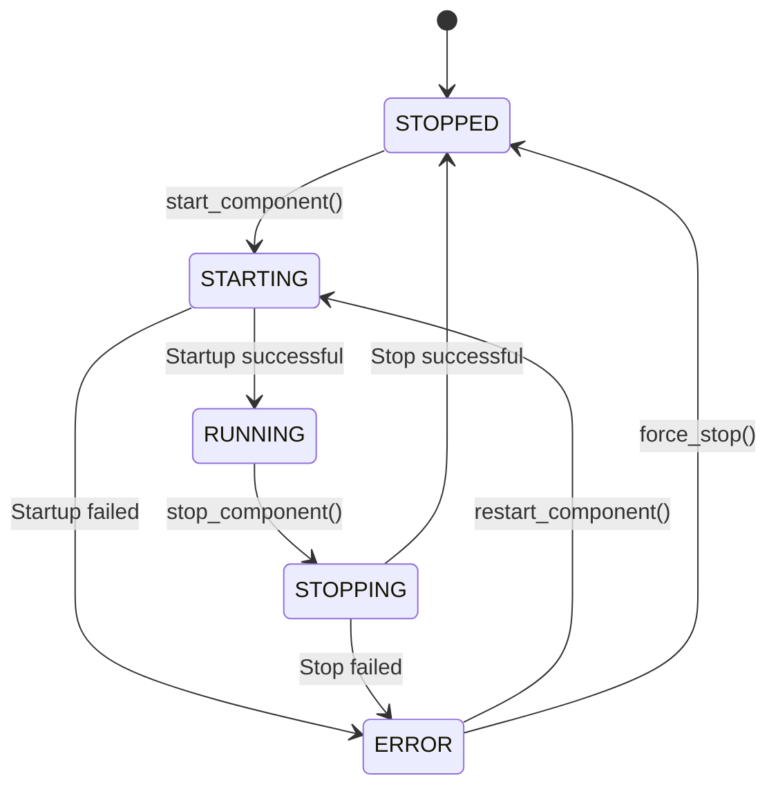

# ServiceContainer Architecture Update Documentation

## Overview

This document covers the major architectural improvements implemented in commit `eabb997` that introduced comprehensive dependency injection and service layer abstraction to the Auto Futures Trading Machine.

## 📋 Table of Contents

1. [Architecture Changes Summary](#architecture-changes-summary)
2. [ServiceContainer Implementation](#servicecontainer-implementation)
3. [ApplicationBootstrapper Pattern](#applicationbootstrapper-pattern)
4. [Gateway Services Layer](#gateway-services-layer)
5. [Component Status Management](#component-status-management)
6. [Migration Impact](#migration-impact)
7. [Developer Guidelines](#developer-guidelines)

---

## Architecture Changes Summary

### Before vs After

#### **Before (Legacy Architecture)**
```
app.py → Direct instantiation → SystemManager → Services
```

#### **After (ServiceContainer Architecture)**
```
app.py → ApplicationBootstrapper → ServiceContainer → SystemManager → Gateway Services
```

### Key Improvements

| Aspect | Before | After |
|--------|--------|-------|
| **Dependency Management** | Manual instantiation | ServiceContainer with DI |
| **Initialization** | Ad-hoc startup | Structured ApplicationBootstrapper |
| **Service Layer** | Direct service access | Gateway Services abstraction |
| **Status Management** | Basic state tracking | ComponentStatus enum with health monitoring |
| **Configuration** | Basic env vars | Comprehensive validation |
| **Process Management** | Simple process control | PID-based lifecycle management |

---

## ServiceContainer Implementation

### Core Concept

The `ServiceContainer` follows the **Dependency Inversion Principle** by centralizing all application dependencies and providing a unified access point.

### Class Structure

```python
class ServiceContainer:
    """Container for all application services and dependencies."""
    
    def __init__(
        self,
        logger: LoggerInterface,
        config: Config,
        session_repository: SessionRepositoryInterface,
        condition_repository: ConditionRepositoryInterface,
        exchange_api: PFCFApi,
    ) -> None:
        # Centralized dependency management
```

### Managed Dependencies

1. **Core Infrastructure**
   - `LoggerInterface` - Application logging
   - `Config` - Configuration management
   - `PFCFApi` - Exchange API integration

2. **Repositories**
   - `SessionRepositoryInterface` - User session management
   - `ConditionRepositoryInterface` - Trading condition persistence

3. **Exchange API Proxies**
   - `exchange_client` - Client interface proxy
   - `exchange_trade` - Trading interface proxy
   - `exchange_decimal` - Decimal handling proxy

### Benefits

- **Centralized Dependency Management**: Single source of truth for all dependencies
- **Interface-Based Design**: Loose coupling through interface abstraction
- **Easy Testing**: Simplified mocking and dependency injection for tests
- **Configuration Consistency**: Unified access to configuration across all services

---

## ApplicationBootstrapper Pattern

### Purpose

The `ApplicationBootstrapper` orchestrates the entire application initialization sequence, ensuring proper dependency setup and validation.

### Initialization Flow

```mermaid
graph TD
    A[Application Start] --> B[ApplicationBootstrapper.bootstrap()]
    B --> C[Create Required Directories]
    C --> D[Initialize Core Components]
    D --> E[Validate Configuration]
    E --> F[Create ServiceContainer]
    F --> G[Create SystemManager]
    G --> H[Application Ready]
    
    C --> C1[tmp/pids/]
    C --> C2[logs/]
    C --> C3[src/data/]
    
    D --> D1[LoggerDefault]
    D --> D2[Config + Env Validation]
    D --> D3[PFCFApi]
    
    F --> F1[Repository Creation]
    F --> F2[Dependency Injection]
```

### Directory Structure Creation

The bootstrapper automatically creates essential directories:

```
project_root/
├── tmp/pids/          # Process ID files for lifecycle management
├── logs/              # Application logs
└── src/data/          # JSON file repositories
```

### Configuration Validation

Comprehensive validation includes:

- **Required Environment Variables**
  - `DEALER_TEST_URL`
  - `DEALER_PROD_URL`

- **DLL Gateway Configuration**
  - Bind address validation
  - Port availability checking
  - Timeout configuration verification

### Error Handling

```python
@dataclass
class BootstrapResult:
    success: bool
    system_manager: Optional[SystemManager] = None
    service_container: Optional[ServiceContainer] = None
    error_message: Optional[str] = None
```

---

## Gateway Services Layer

### Architecture Overview

The Gateway Services layer provides infrastructure abstraction and service orchestration:

```
SystemManager
├── Gateway Services
│   ├── MarketDataGatewayService
│   ├── PortCheckerService
│   └── GatewayInitializerService
├── Core Services
│   ├── DllGatewayServer
│   ├── ProcessManagerService
│   └── StatusChecker
```

### MarketDataGatewayService

**Purpose**: Market data infrastructure management

**Responsibilities**:
- ZMQ Publisher lifecycle management
- PFCF API callback integration
- Real-time quote broadcasting (port 5555)
- Data flow error handling
- Gateway status monitoring

**Key Features**:
```python
class MarketDataGatewayService:
    def start_gateway(self) -> bool
    def stop_gateway(self) -> bool
    def get_status(self) -> ComponentStatus
    def restart_gateway(self) -> bool
```

### PortCheckerService

**Purpose**: Network port availability validation

**Responsibilities**:
- ZMQ port conflict detection (5555, 5556, 5557)
- Network resource validation
- Pre-startup checks
- Port binding verification

**Usage**:
```python
port_checker = PortCheckerService(config, logger)
if port_checker.check_all_ports():
    # Proceed with startup
```

### ProcessManagerService

**Purpose**: Child process lifecycle management

**Responsibilities**:
- PID file management in `tmp/pids/`
- Process startup and shutdown
- Path resolution and validation
- Graceful shutdown mechanisms
- Process status tracking

**PID Management**:
```
tmp/pids/
├── strategy.pid           # Strategy process PID
└── order_executor.pid     # Order executor process PID
```

---

## Component Status Management

### ComponentStatus Enum

```python
class ComponentStatus(Enum):
    STOPPED = "stopped"
    STARTING = "starting"
    RUNNING = "running"
    STOPPING = "stopping"
    ERROR = "error"
```

### State Machine



### SystemHealth Monitoring

```python
@dataclass
class SystemHealth:
    is_healthy: bool
    components: Dict[str, ComponentStatus]
    uptime_seconds: float
    last_check_timestamp: float
```

### Health Check Implementation

- **Real-time Status Tracking**: All components report status changes
- **Uptime Monitoring**: System tracks component uptime
- **Health Aggregation**: Overall system health based on component status
- **Automatic Recovery**: Failed components can be automatically restarted

---

## Migration Impact

### Breaking Changes

1. **Initialization Sequence**
   - Old: Direct service instantiation
   - New: ApplicationBootstrapper required

2. **Dependency Access**
   - Old: Direct imports and instantiation
   - New: ServiceContainer injection

3. **Configuration Access**
   - Old: Global config import
   - New: Injected config via ServiceContainer

### Backward Compatibility

- **API Interfaces**: All public APIs remain unchanged
- **ZMQ Communication**: Message formats and ports unchanged
- **Trading Logic**: Strategy and order execution logic unaffected

### Migration Steps

1. **Update Application Startup**
   ```python
   # Old
   system_manager = SystemManager(...)
   
   # New
   bootstrapper = ApplicationBootstrapper()
   result = bootstrapper.bootstrap()
   system_manager = result.system_manager
   ```

2. **Update Service Access**
   ```python
   # Old
   logger = LoggerDefault()
   
   # New
   logger = service_container.logger
   ```

3. **Update Testing**
   ```python
   # Tests now use ServiceContainer for dependency injection
   service_container = create_test_service_container()
   ```

---

## Developer Guidelines

### Adding New Services

1. **Create Service Interface**
   ```python
   class NewServiceInterface(ABC):
       @abstractmethod
       def perform_action(self) -> bool:
           pass
   ```

2. **Implement Service**
   ```python
   class NewService(NewServiceInterface):
       def __init__(self, config: Config, logger: LoggerInterface):
           self._config = config
           self._logger = logger
   ```

3. **Add to ServiceContainer**
   ```python
   class ServiceContainer:
       def __init__(self, ..., new_service: NewServiceInterface):
           self.new_service = new_service
   ```

4. **Update ApplicationBootstrapper**
   ```python
   def create_service_container(self) -> ServiceContainer:
       new_service = NewService(self._config, self._logger)
       return ServiceContainer(..., new_service=new_service)
   ```

### Testing Guidelines

1. **Use ServiceContainer in Tests**
   ```python
   def test_use_case():
       service_container = create_test_service_container()
       use_case = CreateConditionUseCase(service_container)
       # Test implementation
   ```

2. **Mock Dependencies via Container**
   ```python
   mock_logger = Mock(spec=LoggerInterface)
   service_container = ServiceContainer(logger=mock_logger, ...)
   ```

### Configuration Best Practices

1. **Environment Variables**
   - Use descriptive names
   - Provide sensible defaults
   - Document all variables

2. **Validation**
   - Validate during bootstrap
   - Fail fast with clear error messages
   - Log configuration issues

### Status Management Best Practices

1. **Component Status Updates**
   ```python
   def start_service(self):
       self._status = ComponentStatus.STARTING
       try:
           # Startup logic
           self._status = ComponentStatus.RUNNING
       except Exception:
           self._status = ComponentStatus.ERROR
           raise
   ```

2. **Health Monitoring**
   - Regular health checks
   - Meaningful status reporting
   - Automatic recovery where possible

---

## Conclusion

The ServiceContainer architecture update represents a significant improvement in:

- **Maintainability**: Clear separation of concerns and dependency management
- **Testability**: Simplified mocking and dependency injection
- **Reliability**: Comprehensive status monitoring and health checks
- **Extensibility**: Easy addition of new services and components

This architecture provides a solid foundation for future enhancements while maintaining the system's high-performance trading capabilities.

---

*Last updated: Commit eabb997 - docs: sync documentation with ServiceContainer architecture implementation*