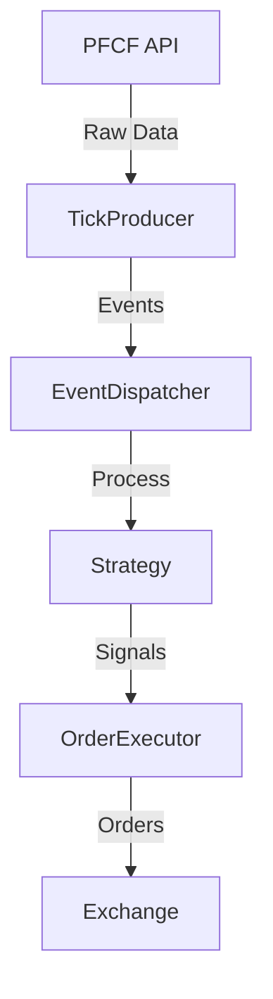

# High-Frequency Trading System Optimization

Date: 2025-04-18

Status: Proposed

## Context

Our futures trading system uses an event-driven architecture to process market data and execute trades. The current implementation has several performance bottlenecks that could affect trading efficiency in high-frequency scenarios.

Key terms:
- **High-Frequency Trading (HFT)**: Trading strategy that uses powerful computers to transact a large number of orders at very fast speeds.
- **Event-Driven Architecture**: A software architecture pattern promoting the production, detection, consumption of, and reaction to events.
- **Backpressure**: A mechanism to prevent overwhelming a system by controlling the flow of data.

## Current Architecture



## Problems

1. **Event Processing Latency**
   - Current delay: 10ms (`asyncio.sleep(0.01)`)
   - Synchronous event handling causes blocking
   - No priority mechanism for critical events

2. **Buffer Management**
   - Fixed-size FIFO queue (1000 events)
   - No backpressure mechanism
   - Potential event loss during high load

3. **Performance Monitoring**
   - Limited latency tracking
   - No real-time performance metrics
   - Difficult to diagnose issues

## Decision

We will implement a comprehensive optimization strategy focusing on three main areas:

### 1. Core Component Optimization

#### 1.1 TickProducer Enhancement
```python
class OptimizedTickProducer:
    def __init__(self, buffer_size=1000):
        self.tick_buffer = BoundedFifoQueue(max_size=buffer_size)
        self._backpressure_threshold = buffer_size * 0.8
        self._latency_monitor = LatencyMonitor()
```

Key improvements:
- Dynamic buffer sizing
- Backpressure handling
- Latency monitoring

#### 1.2 EventDispatcher Optimization
```python
class OptimizedRealtimeDispatcher:
    def __init__(self):
        self._event_handlers = defaultdict(list)
        self._priority_queue = PriorityQueue()
        self._batch_size = 100
```

Key improvements:
- Reduced processing delay (1ms)
- Batch processing
- Priority-based handling

### 2. Performance Monitoring System

```python
class LatencyMonitor:
    def record(self, latency_ms):
        self._latencies.append(latency_ms)
        
    def get_stats(self):
        return {
            'avg_latency': sum(self._latencies) / len(self._latencies),
            'p95_latency': sorted(self._latencies)[int(len(self._latencies) * 0.95)]
        }
```

### 3. Backpressure Mechanism

```python
class BackpressureManager:
    def check(self, current_size, max_size):
        if current_size > max_size * self._threshold:
            self._handle_backpressure()
            return True
        return False
```

## Implementation Plan

### Phase 1: Core Optimization (2 weeks)
1. Implement OptimizedTickProducer
2. Update EventDispatcher
3. Add basic monitoring

### Phase 2: Advanced Features (2 weeks)
1. Implement backpressure
2. Deploy monitoring dashboard
3. Optimize batch processing

### Phase 3: System Integration (1 week)
1. Integrate all components
2. Performance testing
3. Production deployment

## Expected Results

| Metric | Current | Target | Improvement |
|--------|---------|--------|-------------|
| Event Processing Latency | 10ms | 1ms | 90% |
| System Throughput | 1000 events/s | 3000 events/s | 200% |
| Memory Efficiency | 100% | 70% | 30% |

## Risks and Mitigation

### Technical Risks
1. New architecture complexity
2. Performance impact on stability
3. Integration challenges

### Mitigation Strategies
1. Phased implementation
2. Comprehensive testing
3. Rollback plan

## References

1. [High-Frequency Trading System Design](https://www.example.com/hft-design)
2. [Event-Driven Architecture Best Practices](https://www.example.com/eda-best-practices)
3. [Backpressure in Distributed Systems](https://www.example.com/backpressure)

## Conclusion

This optimization strategy will significantly improve our system's performance in high-frequency trading scenarios while maintaining stability and reliability. The phased implementation approach ensures minimal disruption to existing operations. 