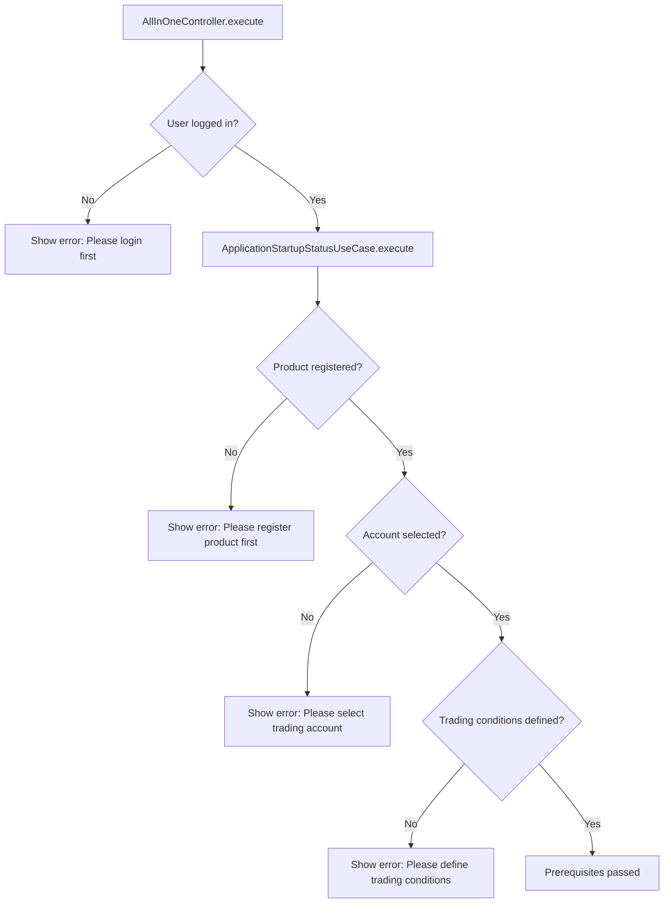
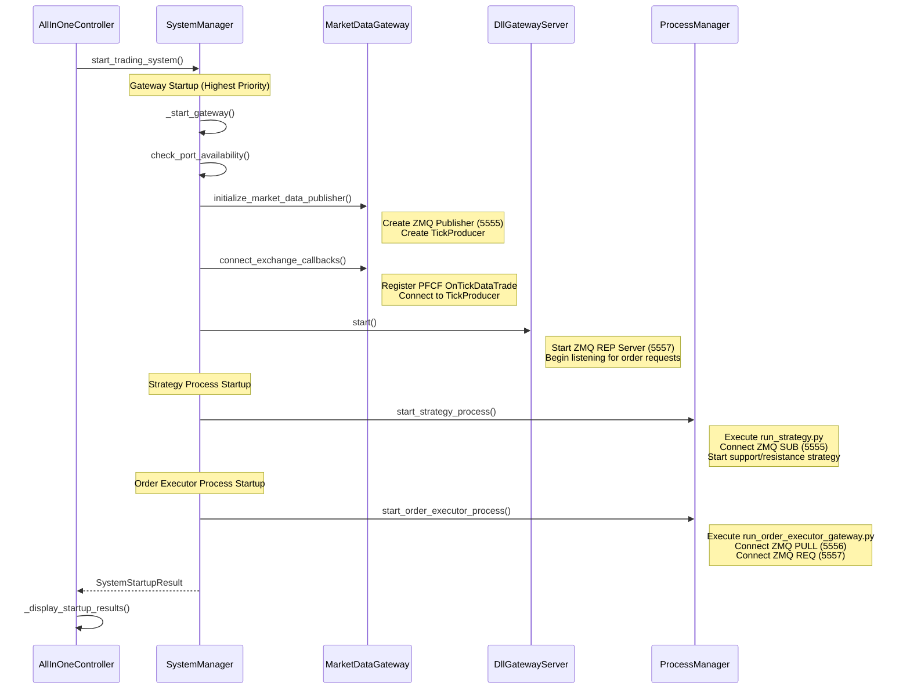
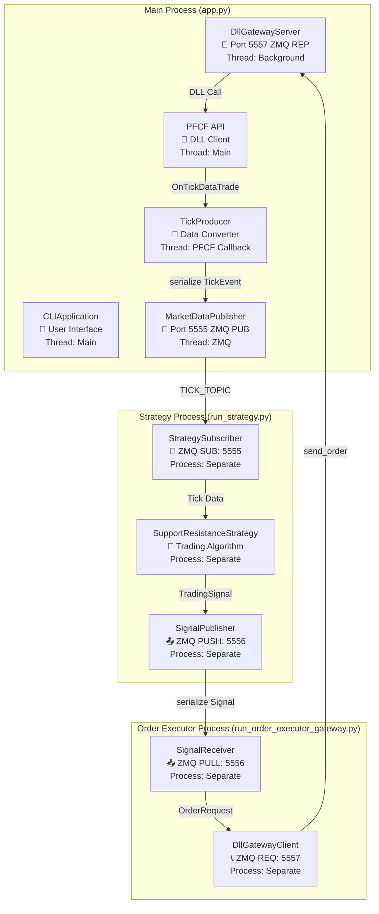
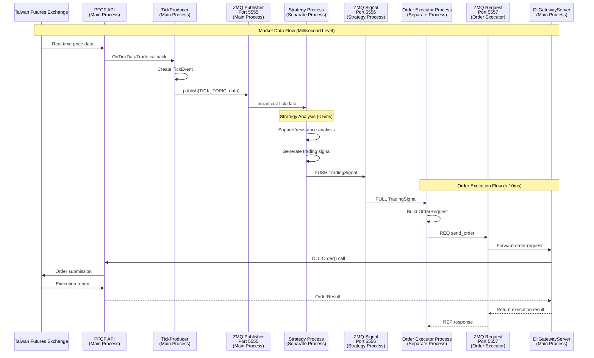
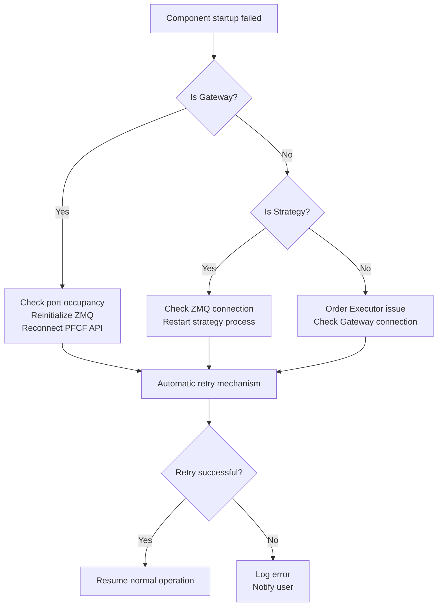

# 🚀 AllInOneController Startup Process & Data Flow Guide

## 📋 Overview

**AllInOneController** is the unified entry point for the futures trading system, responsible for validating prerequisites and starting the entire distributed trading architecture.

## 🎯 Core Responsibilities

1. **Prerequisites Validation** - Ensure the system can start safely
2. **Distributed Component Coordination** - Launch multi-process architecture through SystemManager
3. **User Feedback** - Provide clear startup status and error information

## 🔍 Detailed Initialization Process

### Phase 1: Prerequisites Check



#### Check Items Details

| Check Item | Implementation Location | Failure Impact |
|------------|------------------------|----------------|
| `logged_in` | SessionRepository.is_user_logged_in() | Cannot access PFCF API |
| `item_registered` | StatusChecker via Use Case check | No market data available |
| `order_account_selected` | StatusChecker account configuration check | Cannot execute orders |
| `has_conditions` | StatusChecker trading conditions check | Strategy cannot run |

### Phase 2: System Component Startup



## 🌐 Distributed Architecture & Data Flow

### Three-Process Architecture Overview



### Key Component Functionality Details

#### 🔧 TickProducer (Market Data Converter)

**Location**: `src/infrastructure/pfcf_client/tick_producer.py`

**Core Functions**:
- Receive PFCF API `OnTickDataTrade` callbacks
- Convert raw data to standardized `Tick` and `TickEvent` objects
- Serialize data using msgpack
- Broadcast through ZMQ Publisher to port 5555

```python
def handle_tick_data(self, commodity_id, match_price, ...):
    # 1. Data cleaning and conversion
    price_value = float(match_price)
    tick = Tick(commodity_id=commodity_id.upper(), match_price=price_value)
    
    # 2. Create event
    tick_event = TickEvent(datetime.now(), tick)
    
    # 3. Serialize and publish
    serialized_event = serialize(tick_event)
    self.tick_publisher.publish(TICK_TOPIC, serialized_event)
```

#### 💼 DllGatewayServer (Order Execution Gateway)

**Location**: `src/infrastructure/services/dll_gateway_server.py`

**Core Functions**:
- Listen for ZMQ REP requests on port 5557
- Centralized PFCF DLL access ensuring thread safety
- Supported operations: `send_order`, `get_positions`, `health_check`

```python
def _process_request(self, raw_request):
    request_data = json.loads(raw_request.decode('utf-8'))
    operation = request_data.get("operation")
    
    if operation == "send_order":
        return self._handle_send_order(request_data)
    elif operation == "get_positions":
        return self._handle_get_positions(request_data)
    elif operation == "health_check":
        return self._handle_health_check()
```

## 📊 Data Flow Sequence Diagram

### Complete Trading Lifecycle



## ⚡ Performance Characteristics

### Latency Metrics

| Stage | Target Latency | Key Factors |
|-------|----------------|-------------|
| Tick Processing | < 1ms | ZMQ + msgpack serialization |
| Strategy Decision | < 5ms | Support/resistance algorithm optimization |
| Order Execution | < 10ms | DLL Gateway + network |

### ZMQ Communication Patterns

| Port | Pattern | Purpose | Characteristics |
|------|---------|---------|----------------|
| 5555 | PUB/SUB | Market data broadcast | High throughput, unidirectional |
| 5556 | PUSH/PULL | Trading signal transmission | Load balancing, reliable |
| 5557 | REQ/REP | Order execution requests | Synchronous, with response |

## 🔧 Failure Handling Mechanisms

### Component Startup Failure



### Runtime Error Recovery

| Error Type | Detection Method | Recovery Strategy |
|------------|------------------|-------------------|
| ZMQ connection interruption | Heartbeat check | Automatic reconnection |
| PFCF API disconnection | Callback stopped | Re-login |
| Process crash | Process monitoring | Automatic restart |
| Memory leak | Resource monitoring | Periodic restart |

## 🎯 Key Design Decisions

### Why Use Multi-Process?

1. **Bypass Python GIL** - Achieve true parallel processing
2. **Fault Isolation** - Single process crash doesn't affect other components
3. **Resource Separation** - Different components can be independently optimized
4. **Security Isolation** - Only main process holds PFCF credentials

### Why Use DLL Gateway?

1. **Centralized Security** - Single process manages DLL access
2. **Thread Safety** - Avoid multi-threaded DLL call issues
3. **Connection Pooling** - Efficiently manage PFCF connections
4. **Unified Error Handling** - Centralized error handling and logging

### ProcessManagerService Functionality Clarification

**Actually Used Methods**:
- `start_strategy()`: Start `run_strategy.py` as independent process ✅ **In Use**
- `start_order_executor()`: Start `run_order_executor_gateway.py` as independent process ✅ **In Use**
- `cleanup_processes()`: Clean up all processes and threads ✅ **In Use**

**Cleaned Dead Code**:
- `start_gateway_thread(gateway_runner)`: ✅ **Removed from Interface and implementation classes**
- `gateway_thread` and `gateway_running` attributes: ✅ **Completely removed**

**Cleanup Result**: All unused gateway thread related code has been safely removed, making the system more concise and clear.

## 💡 Usage Guide

### Normal Startup Process

1. Login to system (Option 1)
2. Register product (Option 3)  
3. Select trading account (Option 5)
4. Create trading conditions (Option 4)
5. One-click startup (Option 10) ← **AllInOneController**

### Post-Startup Status Check

- **Gateway**: `✓ Running` - Market data and order execution services running
- **Strategy**: `✓ Running` - Support/resistance strategy analyzing market
- **Order Executor**: `✓ Running` - Automatic order execution ready

### Troubleshooting

| Status Display | Possible Cause | Solution |
|----------------|----------------|----------|
| Gateway `✗ Error` | Port occupied | Check other applications, restart system |
| Strategy `✗ Stopped` | ZMQ connection failed | Confirm Gateway running, check firewall |
| Order Executor `✗ Error` | Gateway unreachable | Restart Gateway, check port 5557 |

---

## 📋 Architecture Description

*This architecture achieves the performance requirements of high-frequency trading systems while maintaining the flexibility and maintainability of Python development.*

### ⚠️ Important Limitations

**Broker Dependency**: This system is highly coupled with Taiwan Unified Futures (PFCF) DLL. If you need to migrate to other brokers, please refer to the [DLL Porting Guide](../architecture/DLL_PORTING_GUIDE.md).