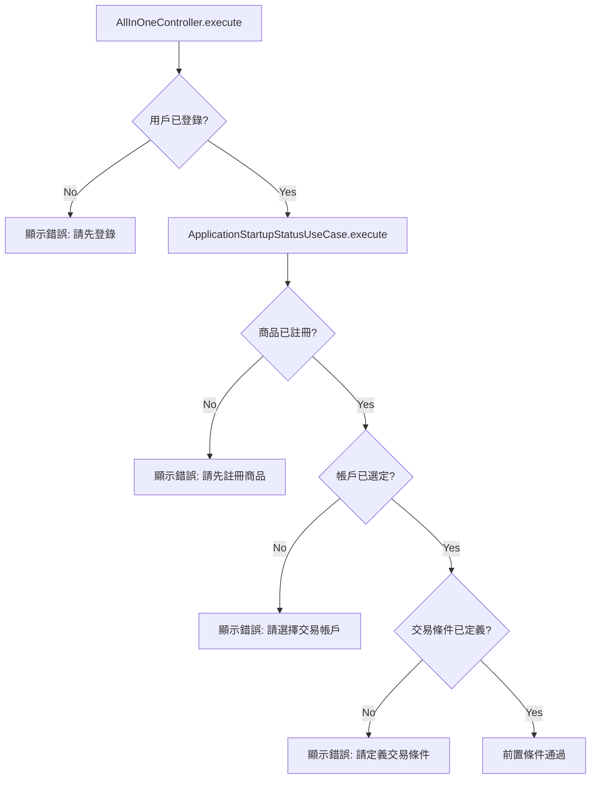
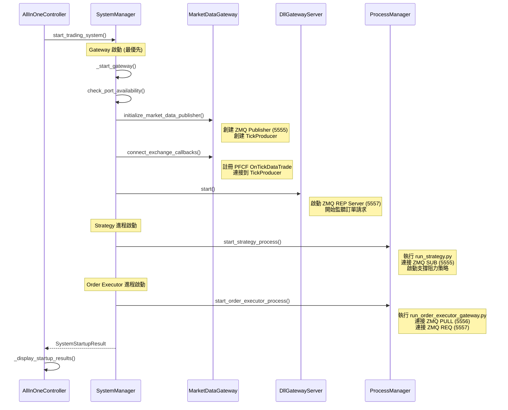
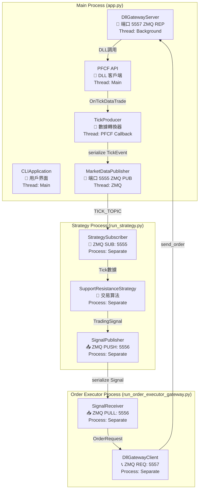
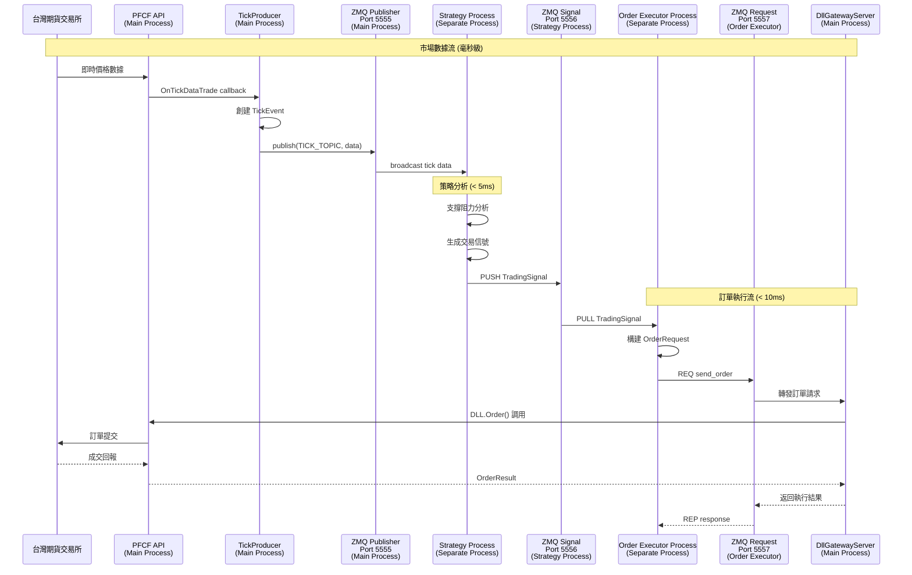
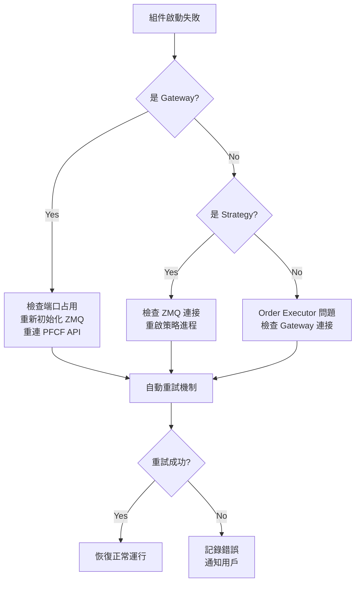

# 🚀 AllInOneController 啟動流程與數據流向指南

## 📋 概述

**AllInOneController** 是期貨交易系統的統一啟動入口，負責驗證前置條件並啟動整個分散式交易架構。

## 🎯 核心職責

1. **前置條件驗證** - 確保系統可以安全啟動
2. **分散式組件協調** - 透過 SystemManager 啟動多進程架構
3. **用戶反饋** - 提供清晰的啟動狀態和錯誤信息

## 🔍 詳細初始化流程

### 階段 1: 前置條件檢查



#### 檢查項目詳解

| 檢查項目 | 實現位置 | 失敗影響 |
|---------|---------|----------|
| `logged_in` | SessionRepository.is_user_logged_in() | 無法訪問 PFCF API |
| `item_registered` | StatusChecker 透過 Use Case 檢查 | 無市場數據可用 |
| `order_account_selected` | StatusChecker 檢查帳戶配置 | 無法執行訂單 |
| `has_conditions` | StatusChecker 檢查交易條件 | 策略無法運行 |

### 階段 2: 系統組件啟動



## 🌐 分散式架構與數據流

### 三進程架構概述



### 關鍵組件功能詳解

#### 🔧 TickProducer (市場數據轉換器)

**位置**: `src/infrastructure/pfcf_client/tick_producer.py`

**核心功能**:
- 接收 PFCF API 的 `OnTickDataTrade` 回調
- 轉換原始數據為標準化 `Tick` 和 `TickEvent` 對象
- 使用 msgpack 序列化數據
- 透過 ZMQ Publisher 廣播到端口 5555

```python
def handle_tick_data(self, commodity_id, match_price, ...):
    # 1. 數據清理和轉換
    price_value = float(match_price)
    tick = Tick(commodity_id=commodity_id.upper(), match_price=price_value)
    
    # 2. 創建事件
    tick_event = TickEvent(datetime.now(), tick)
    
    # 3. 序列化並發佈
    serialized_event = serialize(tick_event)
    self.tick_publisher.publish(TICK_TOPIC, serialized_event)
```

#### 💼 DllGatewayServer (訂單執行網關)

**位置**: `src/infrastructure/services/dll_gateway_server.py`

**核心功能**:
- 監聽端口 5557 的 ZMQ REP 請求
- 集中化 PFCF DLL 訪問，確保線程安全
- 支援操作: `send_order`, `get_positions`, `health_check`

```python
def _process_request(self, raw_request):
    request_data = json.loads(raw_request.decode('utf-8'))
    operation = request_data.get("operation")
    
    if operation == "send_order":
        return self._handle_send_order(request_data)
    elif operation == "get_positions":
        return self._handle_get_positions(request_data)
    elif operation == "health_check":
        return self._handle_health_check()
```

## 📊 數據流向時序圖

### 完整交易生命週期



## ⚡ 性能特性

### 延遲指標

| 階段 | 目標延遲 | 關鍵因素 |
|------|---------|----------|
| Tick 處理 | < 1ms | ZMQ + msgpack 序列化 |
| 策略決策 | < 5ms | 支撐阻力算法優化 |
| 訂單執行 | < 10ms | DLL Gateway + 網路 |

### ZMQ 通信模式

| 端口 | 模式 | 用途 | 特性 |
|------|------|------|------|
| 5555 | PUB/SUB | 市場數據廣播 | 高throughput, 單向 |
| 5556 | PUSH/PULL | 交易信號傳遞 | 負載平衡, 可靠 |
| 5557 | REQ/REP | 訂單執行請求 | 同步, 有回應 |

## 🔧 故障處理機制

### 組件啟動失敗



### 運行時錯誤恢復

| 錯誤類型 | 檢測方式 | 恢復策略 |
|---------|---------|---------|
| ZMQ 連接中斷 | 心跳檢查 | 自動重連 |
| PFCF API 斷線 | 回調停止 | 重新登錄 |
| 進程崩潰 | 進程監控 | 自動重啟 |
| 內存洩漏 | 資源監控 | 定期重啟 |

## 🎯 關鍵設計決策

### 為什麼使用多進程?

1. **繞過 Python GIL** - 實現真正的並行處理
2. **故障隔離** - 單一進程崩潰不影響其他組件
3. **資源分離** - 不同組件可以獨立調優
4. **安全隔離** - 只有主進程持有 PFCF 憑證

### 為什麼使用 DLL Gateway?

1. **集中化安全** - 單一進程管理 DLL 訪問
2. **線程安全** - 避免多線程 DLL 調用問題
3. **連接池化** - 高效管理 PFCF 連接
4. **錯誤統一處理** - 集中化錯誤處理和日誌記錄

### ProcessManagerService 功能澄清

**實際使用的方法**:
- `start_strategy()`: 啟動 `run_strategy.py` 作為獨立進程 ✅ **有使用**
- `start_order_executor()`: 啟動 `run_order_executor_gateway.py` 作為獨立進程 ✅ **有使用**
- `cleanup_processes()`: 清理所有進程和線程 ✅ **有使用**

**已清理的死代碼**:
- `start_gateway_thread(gateway_runner)`: ✅ **已從 Interface 和實現類中移除**
- `gateway_thread` 和 `gateway_running` 屬性: ✅ **已完全移除**

**清理結果**: 所有未使用的 gateway thread 相關代碼已被安全移除，系統更加簡潔明確。

## 💡 使用指南

### 正常啟動流程

1. 登錄系統 (選項 1)
2. 註冊商品 (選項 3)  
3. 選擇交易帳戶 (選項 5)
4. 創建交易條件 (選項 4)
5. 一鍵啟動 (選項 10) ← **AllInOneController**

### 啟動後狀態檢查

- **Gateway**: `✓ Running` - 市場數據和訂單執行服務運行中
- **Strategy**: `✓ Running` - 支撐阻力策略正在分析市場
- **Order Executor**: `✓ Running` - 自動訂單執行已就緒

### 故障排除

| 狀態顯示 | 可能原因 | 解決方案 |
|---------|---------|---------|
| Gateway `✗ Error` | 端口被占用 | 檢查其他應用程式, 重啟系統 |
| Strategy `✗ Stopped` | ZMQ 連接失敗 | 確認 Gateway 運行, 檢查防火牆 |
| Order Executor `✗ Error` | Gateway 不可達 | 重啟 Gateway, 檢查端口 5557 |

---

## 📋 架構說明

*這個架構實現了高頻交易系統的性能要求，同時保持了 Python 開發的靈活性和可維護性。*

### ⚠️ 重要限制

**券商依賴性**: 本系統與統一期貨 (PFCF) DLL 高度耦合。如需移植到其他券商，請參考 [DLL 移植指南](../architecture/DLL_PORTING_GUIDE.md)。